# Mesh-Client

Cross-platform **Electron** desktop client for **Meshtastic**, **MeshCore**, and **Reticulum (LXMF)** on **macOS**, **Linux**, and **Windows** with **BLE**, **USB serial**, **Wi-Fi/TCP**, **MQTT**, local **SQLite** history, **routing diagnostics**, and **16-language UI**.

This page is the docs landing view. The full repository README (badges, feature reference, usage) lives on [GitHub](https://github.com/Colorado-Mesh/mesh-client/blob/main/README.md).

---

## Why

Mesh-Client provides one desktop workflow for **Meshtastic**, **MeshCore**, and **Reticulum** (LXMF via AGPL sidecar) with persistent local storage and protocol-specific diagnostic tooling.

Key outcomes:

- True message persistence with SQLite-backed history.
- Unified interface across Meshtastic, MeshCore, and Reticulum (tri-protocol switcher: green / cyan / amber).
- Advanced mesh visibility via diagnostics, map/topology overlays, and routing insights.
- Multi-language support (16 languages) with offline static bundles.
- Cross-platform desktop support for macOS, Linux, and Windows.

**Protocol scope:** Mesh-Client focuses on RF mesh (LoRa and related). Additional protocols are in scope when they support that RF mesh path. Internet-only stacks are out of scope; ham protocols are fine when they meet the RF-mesh bar. Mesh-Client is for everyone, everywhere—not gated or targeted specifically at licensed amateurs. Protocols that already ship may still use internet transports _alongside_ RF. See [README — Why](https://github.com/Colorado-Mesh/mesh-client/blob/main/README.md#why).

---

## Visuals

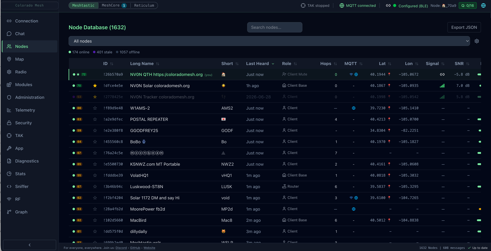
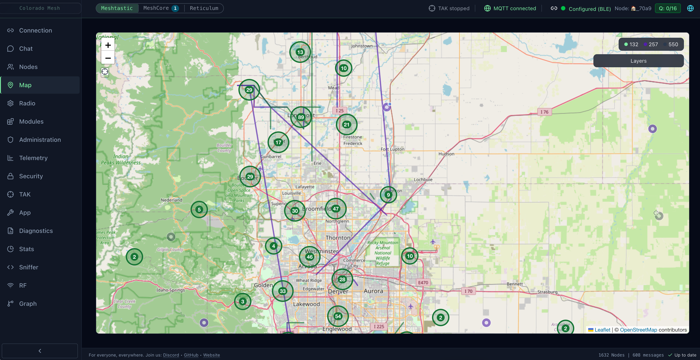
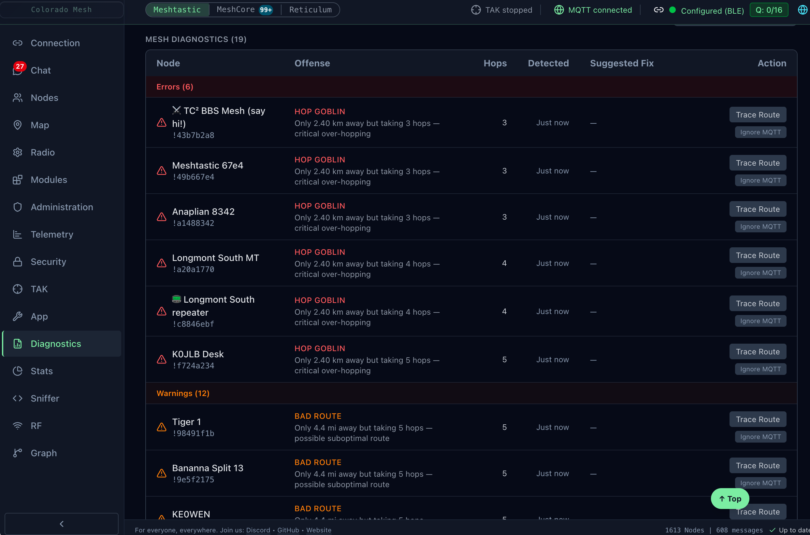
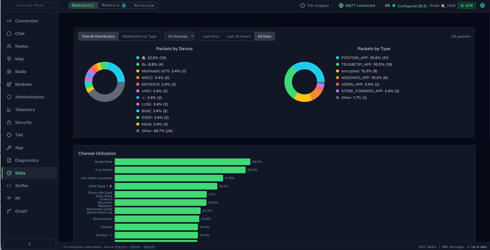

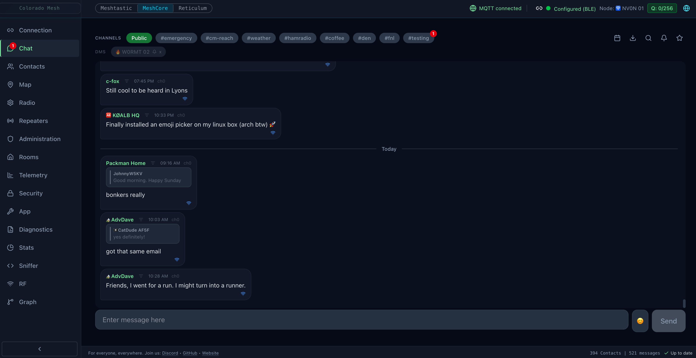
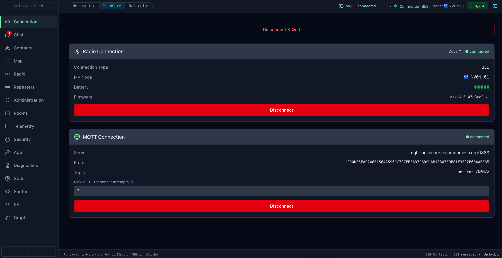
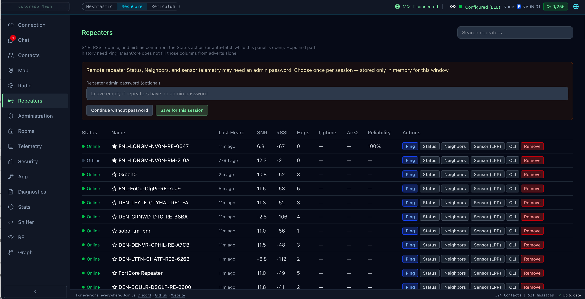
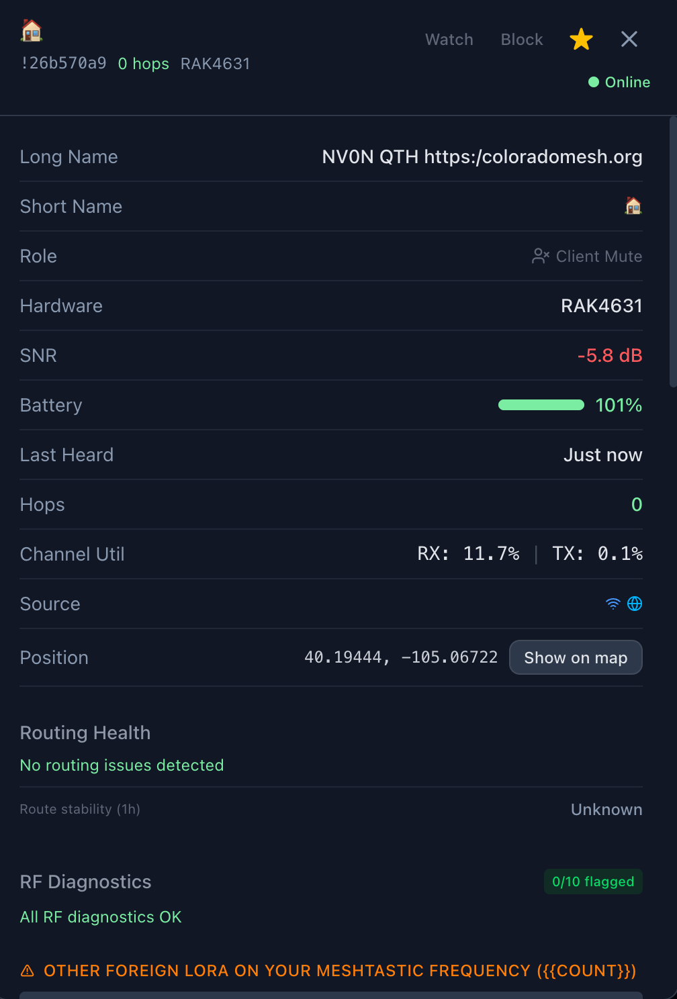

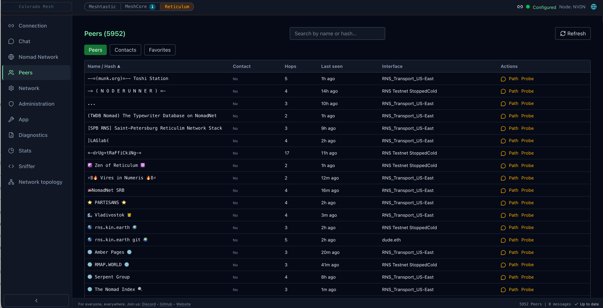
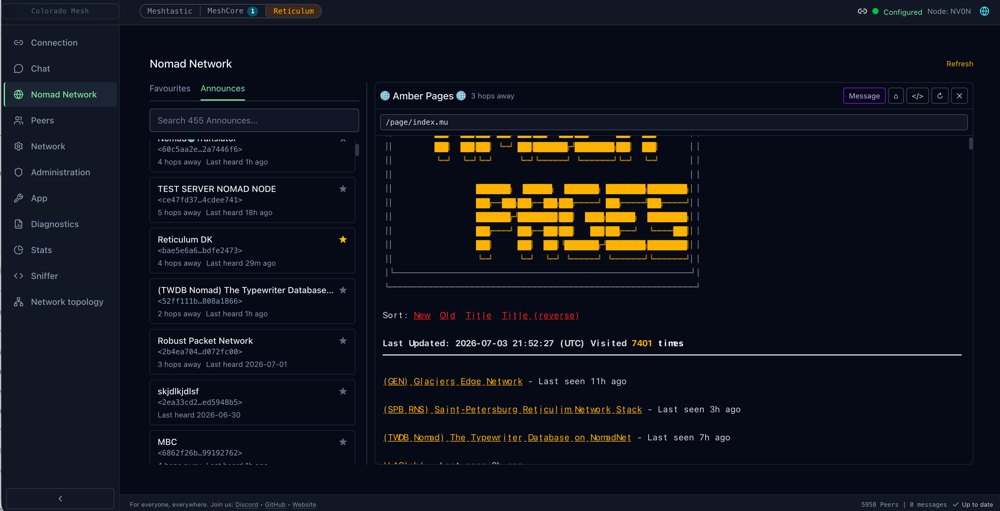
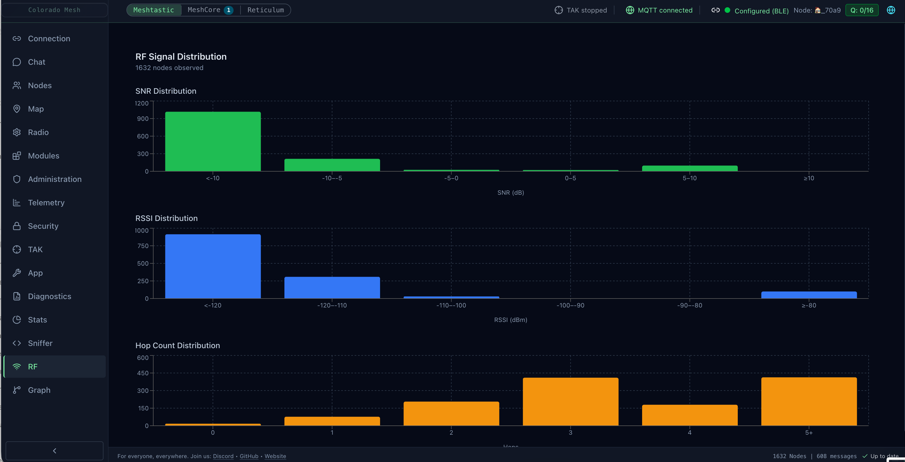
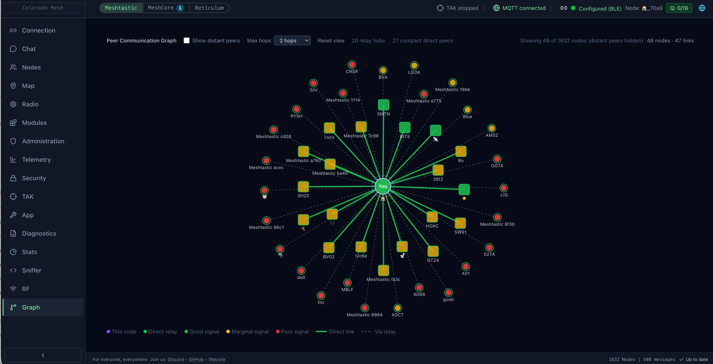
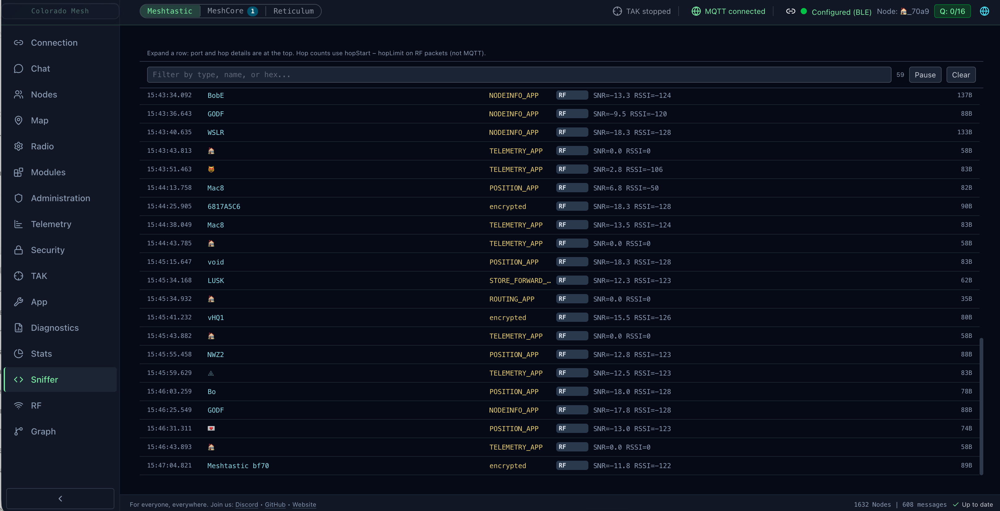
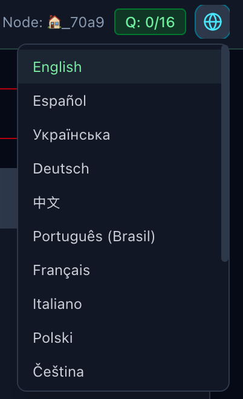

---

## Quick Start

Pre-built binaries are available in [GitHub Releases](https://github.com/Colorado-Mesh/mesh-client/releases).

**macOS:** prefer the **`.dmg`**. If you use the **`.zip`**, extract with **[Keka](https://www.keka.io/en/)** or `ditto -xk` — not **7-Zip** (can break framework symlinks and crash at launch). See [Troubleshooting — Squirrel.framework](troubleshooting.md#macos-library-not-loaded-squirrelframework-after-zip-extract).

Arch Linux users may also find a **third-party** AUR package ([`mesh-client`](https://aur.archlinux.org/packages/mesh-client)) — not maintained by Colorado Mesh; prefer GitHub Releases for official builds.

For development setup, scripts, test harness, and git hooks, see [Development Guide](development-environment.md).

Also useful:

- [Troubleshooting](troubleshooting.md)
- [Contributing](contributing.md)

**Reticulum tab:** packaged builds include the `mesh-client-reticulum` sidecar. Dev builds need Rust and `pnpm run reticulum:sidecar:build` — see [Reticulum in mesh-client](reticulum.md) and [Reticulum sidecar (optional)](development-environment.md#reticulum-sidecar-optional).

---

## Docs Guide

- **Engineering**
  - [Development Guide](development-environment.md) — prerequisites, all `pnpm` scripts, pre-commit hook, i18n workflow
  - [Accessibility Checklist](accessibility-checklist.md)
  - [Contributing](contributing.md)
  - Renderer hook/runtime/store boundaries — [docs/agents/renderer-hooks.md](https://github.com/Colorado-Mesh/mesh-client/blob/main/docs/agents/renderer-hooks.md) and [ARCHITECTURE.md](https://github.com/Colorado-Mesh/mesh-client/blob/main/ARCHITECTURE.md)
  - Agent subsystem reference (deep, on-demand) — [docs/agents/](https://github.com/Colorado-Mesh/mesh-client/blob/main/docs/agents/README.md)
- **Meshtastic & MeshCore**
  - [Feature Parity](meshcore-meshtastic-parity.md) (includes **Rooms** BBS and shared **ChatComposer**)
  - [MQTT Auth](letsmesh-mqtt-auth.md)
  - Room login/posts — [Troubleshooting](troubleshooting.md#meshcore-room-server-login-posts-and-windows-10)
- **Reticulum**
  - [Reticulum in mesh-client](reticulum.md) (sidecar, interfaces, LXMF chat, **RRC**, **Remote** rnsh/rncp, **Nomad My Pages**, propagation)
  - [Sidecar IPC contract](reticulum-sidecar-ipc.md)
  - [Reticulum troubleshooting](troubleshooting.md#reticulum) (sidecar, interfaces, Nomad, Remote transfer, RNode Wi‑Fi)
  - Noble BLE coexistence when a Reticulum BLE RNode is connected — [Troubleshooting](troubleshooting.md#reticulum-ble-rnode-blocks-meshtasticmeshcore-noble-ble)
  - Sidecar build / start failures — [Troubleshooting](troubleshooting.md#reticulum-sidecar-wont-start-or-health-poll-times-out)
- **Support**
  - [Diagnostics](diagnostics.md) — LoRa routing/RF (Meshtastic & MeshCore), foreign LoRa overhear (Meshtastic & MeshCore tabs), Reticulum interface audit; protocol-scoped row filtering
  - [Key backup and cryptography](key-backup-and-crypto.md) (per-node full key pair backup; MT → MC migration)
  - [Troubleshooting](troubleshooting.md)
  - Export for GitHub / stuck Chat — [Troubleshooting](troubleshooting.md#reporting-bugs-export-for-github-app-tab)
  - [Localization & Languages](localization.md)
  - [Meshtastic: mesh vs local client telemetry](meshtastic-telemetry-local-client.md)
- **Project**
  - [License](license.md)
  - [Credits](credits.md)
  - [Third-party licenses](third-party-licenses.md)
  - [CI/CD](ci-cd.md) — workflows, local `act` runs, packaging
  - [Release process](release-process.md)
  - [Reticulum Games parity](reticulum-games-parity.md) — Ratspeak Games tab checklist
  - [Nomad hosting interop](nomad-hosting-interop.md)

---

## Frequently Asked Questions

### Is there a way to add a hashtag channel?

Yes. When adding or editing a channel in the **Radio** tab, click **"Derive from name"** and make sure the channel name includes the `#` prefix (e.g., `#general`). This generates the PSK from the SHA-256 hash of the name with the leading `#`.

### How do I use Reticulum?

Select the **Reticulum** pill (amber) in the header → **Connection** → **Start stack** → **Network** to create or import identity → add **Interfaces** (TCP, Auto, or RNode). Chat is **DM-only** over LXMF. See [reticulum.md](reticulum.md) for RNode Wi‑Fi, propagation nodes, and sidecar build steps.
