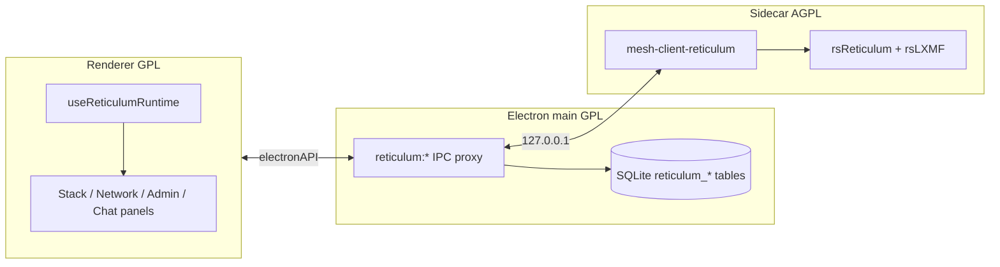
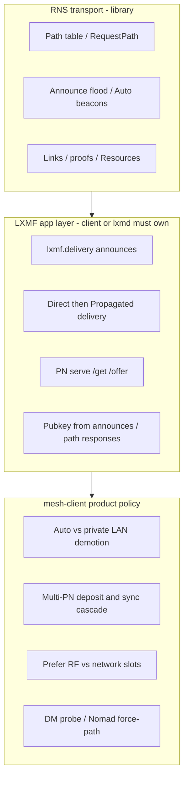

# Reticulum in mesh-client

Reticulum is a **shipped third protocol** in mesh-client (amber header pill). It runs alongside Meshtastic and MeshCore in the same Electron app: switch tabs without stopping the other stacks.

The GPL-3.0-or-later TypeScript UI talks to an **AGPL-3.0-or-later Rust sidecar** (`mesh-client-reticulum`) over localhost HTTP/WebSocket via `electronAPI.reticulum`. LXMF chat history and contacts persist in the main-process SQLite database. **Flatpak** releases always bundle the sidecar; **macOS / Linux / Windows** installers include it when `resources/reticulum-sidecar/` is populated at packaging time (see [Release Process — Reticulum sidecar](release-process.md#reticulum-sidecar-in-installers)). See [License](license.md) and [Credits — bundled binaries](credits.md#bundled-binaries).

**Primary interop:** [Ratspeak](https://github.com/ratspeak/Ratspeak) peers on [rsReticulum](https://github.com/ratspeak/rsReticulum) / [rsLXMF](https://github.com/ratspeak/rsLXMF). Nomad page hosting uses sibling [Colorado-Mesh/rsNomad](https://github.com/Colorado-Mesh/rsNomad) (`nomad-core`).

Related docs: [README — Reticulum Features](../README.md#reticulum-features), [Sidecar IPC contract](reticulum-sidecar-ipc.md), [Games parity (Ratspeak)](reticulum-games-parity.md), [Development — Reticulum sidecar](development-environment.md#reticulum-sidecar-optional), [Troubleshooting — Reticulum](troubleshooting.md#reticulum).

---

## Quick start

**First time?** Select **Reticulum → Connection → Open setup guide**. The [setup wizard](reticulum-setup-guide.md) walks through your identity, an internet or radio connection, readiness checks, and your first conversation. You can reopen it whenever you need a refresher.

For manual setup:

1. Select the **Reticulum** pill (amber) in the header.
2. **Connection** → **Start stack** (optional **Auto-start** for next launch).
3. **Network** → generate or import your LXMF identity (stack must be running).
4. **Connection → Interfaces** → add and enable transports (TCP hub, I2P, Auto, or RNode over USB / BLE / Wi‑Fi). Use **Add default backbones** to sync community backbone presets by region (adds missing rows disabled, repairs mismatched endpoints, disables decommissioned official testnet hubs, skips correct ones) after identity is configured. **Enable 1 to 3 backbone gateways at most** (2 is the sweet spot; local RNodes/LAN do not count).
5. **Chat** → LXMF direct messages. **Games** → Tic-Tac-Toe / Chess over LRGP (or Challenge from Peers / Chat DM). **Remote** → rnsh shell + rncp file send/receive/fetch (high-speed paths). **RRC** → multi-hub relay chat. **Peers** and **Topology** for path-table visibility. **Nomad Network** → browse announced nodes or open **My Pages** to host a static Nomad site.

After changing interfaces on a live network, **restart the stack** so RNS picks up transport changes.

---

## What is included

| Area            | Shipped behavior                                                                                                                                                                                                                                                                                                                                                                                                                                                                                                                                                                                                                                                                                                                                                                                                                                                                                                                                                                                                                                                                                                                                                                                        |
| --------------- | ------------------------------------------------------------------------------------------------------------------------------------------------------------------------------------------------------------------------------------------------------------------------------------------------------------------------------------------------------------------------------------------------------------------------------------------------------------------------------------------------------------------------------------------------------------------------------------------------------------------------------------------------------------------------------------------------------------------------------------------------------------------------------------------------------------------------------------------------------------------------------------------------------------------------------------------------------------------------------------------------------------------------------------------------------------------------------------------------------------------------------------------------------------------------------------------------------- |
| Stack lifecycle | Start / stop / auto-start; disconnect & quit. Sidecar **listen-first**: HTTP binds before live RNS/LXMF attach; Connect marks **configured** when HTTP + identity are ready (live attach / BLE may still be in progress)                                                                                                                                                                                                                                                                                                                                                                                                                                                                                                                                                                                                                                                                                                                                                                                                                                                                                                                                                                                |
| Interfaces      | TCP client, I2P (`peers`), Auto discovery, RNode (USB serial, `ble://…`, Wi‑Fi `tcp://host:7633`); default hub picker by region (Primary & Global selected by default; added disabled; syncs/repairs selected endpoints and disables remaining decommissioned testnet hubs)                                                                                                                                                                                                                                                                                                                                                                                                                                                                                                                                                                                                                                                                                                                                                                                                                                                                                                                             |
| Identity        | Generate / import mnemonic; Ratspeak `.rsi` PIN backup; official raw identity file export/import; **identity vault** optional local `.rsi` store                                                                                                                                                                                                                                                                                                                                                                                                                                                                                                                                                                                                                                                                                                                                                                                                                                                                                                                                                                                                                                                        |
| LXMF chat       | DM-only text, reactions, and **voice memos** (`FIELD_AUDIO` / `AM_OPUS_OGG`, Ratspeak wire parity; ~240 KiB / ~4 min cap under the 256 KiB LXMF field + default PN deposit). Attachment labels render; **cached raster images** display inline; use Remote rncp for peer files. **LXST live voice Call** is separate telephony (rsLXST), not an LXMF voice clip. Oversized memos that exceed the PN deposit limit surface as Direct-only (`message_too_large_for_propagation`) — never as a PN outage.                                                                                                                                                                                                                                                                                                                                                                                                                                                                                                                                                                                                                                                                                                  |
| Remote          | **rnsh** multi-session shell + **rncp** send/receive/fetch under one tab (Shell / Transfer / Saved / Settings); Chat DM send-file convenience; path-speed gate (TCP/network); inbound Ask/allow-list; auto-reconnect / auto-retry; LXMF “request enable receive” prompt between mesh-client peers                                                                                                                                                                                                                                                                                                                                                                                                                                                                                                                                                                                                                                                                                                                                                                                                                                                                                                       |
| RRC             | Reticulum Relay Chat — discovered/manual/favourite hubs, up to **8** concurrent sessions, hub/room auto-join, rooms, nicklists, slash commands (`/list`, `/who`, `/join`, …), unread badges + sounds for any new room message by default (also badges the **Reticulum protocol pill** with LXMF Chat; **App → Notifications** can switch to IRC-style DMs/@mentions only), toasts when the RRC tab is inactive, automatic reconnect with backoff                                                                                                                                                                                                                                                                                                                                                                                                                                                                                                                                                                                                                                                                                                                                                        |
| Delivery        | **Direct** when destination is in path table (outbound-initiated Direct replies need the sidecar **outbound Direct backchannel**). After Direct exhausts: **multi-PN cascade** — preferred remote → other enabled remotes (hop-sorted) → in **Auto** only, up to 3 heard-but-not-added **Discovered** PNs (hop-sorted, never persisted) → **local-prop last**. Remote PN Completes as `delivered` (**Stored at propagation node**, PN + green check); local-prop Completes as `stored_locally` (deposited on your hosted PN — PN + amber house; full PN parity with `lxmd`, including peer `/offer` sync — not an outbox). Propagation mode **Off** disables the cascade entirely. **Paper** for offline encrypted QR/`lxm://` handoff (no network — Completes immediately, no `lxmf_outbound_status`). Path/transport badges (RF/BLE/TCP/NET, multi, PN, Paper) are egress evidence — network UI stays **Sending** until `lxmf_outbound_status` (`delivered` / `stored_locally` / `failed`). Terminal `delivery_status` + `delivery_method` persist in SQLite. Hosted-PN Completes ≠ recipient opened Chat. Inbound `received_via` / TCP badges use local interface **config type**, not display name. |
| Peers           | RNS path table + messaged History + saved Contacts + Favorites (Peers tab sub-tabs); LXMFace avatars; probe; **LXST Call** and **LRGP Challenge** on rows; peer detail modal (Save as contact is manual)                                                                                                                                                                                                                                                                                                                                                                                                                                                                                                                                                                                                                                                                                                                                                                                                                                                                                                                                                                                                |
| Games           | LRGP Tic-Tac-Toe + Chess via sibling [lrgp-rs](https://github.com/ratspeak/lrgp-rs); Games tab + Challenge from Peers/Chat; opponent labels via `resolveReticulumRemoteHashLabel`; deep-link `lrgp:<session>` / `lxm://game/<id>`; delivery chips + resend-after-restart (`games_outbound.db`); Chess promotion picker + threefold/50-move claims; wire-compatible with Ratspeak ([parity checklist](reticulum-games-parity.md))                                                                                                                                                                                                                                                                                                                                                                                                                                                                                                                                                                                                                                                                                                                                                                        |
| Topology        | Best-effort graph from path-table next hops (not a full multi-hop trace)                                                                                                                                                                                                                                                                                                                                                                                                                                                                                                                                                                                                                                                                                                                                                                                                                                                                                                                                                                                                                                                                                                                                |
| Map             | Local RMAP v4 discovery map (heard opt-in interfaces with GPS); link to rmap.world for global view                                                                                                                                                                                                                                                                                                                                                                                                                                                                                                                                                                                                                                                                                                                                                                                                                                                                                                                                                                                                                                                                                                      |
| Nomad Network   | Favourites / announces list (collapsible sidebar, default Favourites sub-tab) plus **My Pages** watched-folder hosting; **lazy-mount after first visit**; Micron (.mu) browser in a **dual-axis scroll shell**; **fit-width wrap default** with open-width toggle for ASCII pages; in-page navigation, back/forward, session page cache, `/file/` downloads, source toggle, and lxmf:// DM links; page/file errors humanized via `nomadPageErrorHumanize.ts`. Local hosting uses sibling [rsNomad](https://github.com/Colorado-Mesh/rsNomad) (`nomad-core`) for static `/page` + `/file` serving and `nomadnetwork.node` announces (no CGI). Choose a site root (`pages/`) or pages directory; FS watcher reloads routes; `nomad_serving_enabled` auto-restores after stack start. My Pages also supports in-app `.mu` authoring (new / edit / delete) via the **Micron page editor** (source + live preview); no file uploads.                                                                                                                                                                                                                                                                         |
| Propagation     | **Propagation mode** (Off / Auto / Manual; default **Off**) with per-mode guidance — Off disables sync **and** the outbound PN cascade. **Sync** is **client `/get`-primary** (inbox into Chat; UI progress from `PropagationClient`). Auto order: **finite-hop Discovered** (no Add/Preferred) → configured remotes → **unknown-hop Discovered** → local-prop; **Ignored for Auto** hashes are skipped for sync and deposit. Manual: Preferred (or closest added for that sync) → other remotes → local-prop. Hard-fails with `PROPAGATION_PATH_UNKNOWN` when no path after announce settle. Peer `/offer` inventory push stays on the **Host peer loop** when serving. **Outbound deposit cascade** (separate): preferred / configured remotes → in Auto up to 3 Discovered PNs (plausible hops ≤32) → local-prop last. Preferred, per-node Sync, rename/delete, Discovered Add/`/offer` probe, local PN hosting, auto-sync interval, Advanced PN hosting policy.                                                                                                                                                                                                                                     |
| Diagnostics     | Reticulum-native interface / path / LXMF health and config audit (`reticulum/*` rows only on this tab; LoRa Hop Goblins and foreign-LoRa tables are Meshtastic/MeshCore-scoped)                                                                                                                                                                                                                                                                                                                                                                                                                                                                                                                                                                                                                                                                                                                                                                                                                                                                                                                                                                                                                         |
| Admin           | RNode firmware flasher (Web Serial), stack factory reset                                                                                                                                                                                                                                                                                                                                                                                                                                                                                                                                                                                                                                                                                                                                                                                                                                                                                                                                                                                                                                                                                                                                                |
| Sniffer / Stats | Reticulum packet log tab (`rawPacketLog.reticulum.*`)                                                                                                                                                                                                                                                                                                                                                                                                                                                                                                                                                                                                                                                                                                                                                                                                                                                                                                                                                                                                                                                                                                                                                   |
| Coexistence     | BLE on a **different** MAC from Meshtastic/MeshCore; scan mutex; **Noble BLE yield** when an enabled BLE RNode is in config (sidecar suspends Noble on macOS/Windows so btleplug can pair)                                                                                                                                                                                                                                                                                                                                                                                                                                                                                                                                                                                                                                                                                                                                                                                                                                                                                                                                                                                                              |

**Not in Reticulum mode:** Meshtastic/MeshCore-style RF channel chat, MQTT broker card, Meshtastic/MeshCore LoRa node position map, Rooms BBS, TAK, Meshtastic PKI Security tab, Hop Goblins routing diagnostics. (RRC is hub room chat over Reticulum Links — not LoRa RF channels.)

---

## Sidebar tabs

| Tab             | Role                                                                                                                                                                                                                                                                          |
| --------------- | ----------------------------------------------------------------------------------------------------------------------------------------------------------------------------------------------------------------------------------------------------------------------------- |
| Connection      | Stack start/stop, auto-start, interfaces CRUD, interface health, sidecar interface-issue banner (clears when hubs are disabled/removed), **Pick device** (serial / BLE)                                                                                                       |
| Chat            | LXMF DMs (+ rncp Send file when peer has a receive destination)                                                                                                                                                                                                               |
| Games           | LRGP Tic-Tac-Toe + Chess (`GamesPanel`, `Gamepad2` icon); challenge/accept/play; Challenge also on Peers / Chat DM                                                                                                                                                            |
| Remote          | rnsh shell + rncp transfer (`ReticulumRemotePanel`): multi-session terminals, send/fetch/receive, saved addresses, inbound policy                                                                                                                                             |
| RRC             | Multi-hub relay chat (`RrcPanel`): favourites/discovered hubs, rooms, nicklist, slash commands, reconnect                                                                                                                                                                     |
| Nomad Network   | Favourites, announces, **My Pages** (watched-folder static host via rsNomad; auto-restore when stack starts), Micron page browser (dual-axis scroll shell, fit-width default + open-width toggle, navigation, cache, file downloads); lazy-mount keep-alive after first visit |
| Peers           | Path-table **Peers**, messaged **History** (`last_heard`), saved **Contacts** (`is_contact`), **Favorites**; ranked multi-path slots + per-peer medium pin in peer path detail (sidebar label **Peers**; Meshtastic/MeshCore use **Nodes** with All/History DM tabs)          |
| Network         | Identity, stack settings (including global **path medium** preference), announces, propagation (preferred, sync, rename/delete remote nodes), config import/export, identity vault (sidebar label **Network**; LoRa tabs use **Radio**)                                       |
| Admin           | RNode firmware flasher; factory reset (danger zone)                                                                                                                                                                                                                           |
| Diagnostics     | Reticulum runtime rows + interface config audit/repair; LoRa routing/RF and foreign-LoRa findings hidden                                                                                                                                                                      |
| Topology        | Path-table graph (force layout; `via_hash` next-hop edges)                                                                                                                                                                                                                    |
| Map             | RMAP v4 discovery map (local heard interfaces + path-table reachability overlay)                                                                                                                                                                                              |
| Stats / Sniffer | Packet log views (`rawPacketLog.reticulum.*`)                                                                                                                                                                                                                                 |
| App             | Shared app settings, DB tools, appearance (includes **Log panel** toggle)                                                                                                                                                                                                     |

Hidden tabs (Meshtastic/MeshCore only): Modules/Repeaters, Rooms, Telemetry, Security, TAK, RF, Graph.

The **Log panel** (right rail, toggled from **App → Log panel**) is shared across protocols; on Reticulum it shows sidecar and local-interface lines tagged for filtering.

### Default hub presets

**Connection → Interfaces** offers **Add default backbones**, which opens a regional checkbox picker (Primary & Global Backbone selected by default). **Enable 1 to 3 backbone gateways at most**—2 is the sweet spot for redundancy without bandwidth bloat (1 global hub + 1 regional gateway; specialty like I2P/Yggdrasil only as needed). Locally connected RNodes and local LAN interfaces do not count toward this limit. The UI warns when more than three default backbones are enabled. Sync applies only the selected presets from [`reticulumDefaultHubPresets.ts`](../src/renderer/lib/reticulum/reticulumDefaultHubPresets.ts). New presets are added **disabled** so you can enable them after review (add always sets `mode=boundary`). The sync **skips** rows that already match the preset (including any valid rnsd `mode`), **repairs** rows that match the same TCP host+port or I2P peer but have wrong name/type/host formatting or a missing/invalid `mode` (missing/invalid → `boundary`; does not overwrite a valid non-boundary mode or change `enabled`), **disables** enabled interfaces pointed at remaining decommissioned official testnet endpoints (Amsterdam) even when those hubs were not in the selected region set, and **adds** missing selected presets. The interfaces list is grouped by the same regions, with non-preset rows under **User Defined**. Disabled rows are visually muted; use row checkboxes and **Delete selected** to remove many interfaces at once (system-managed rows are not selectable):

| Region           | Preset                   | Type | Host                                                           |
| ---------------- | ------------------------ | ---- | -------------------------------------------------------------- |
| Primary & Global | RNS Dublin Mainnet       | TCP  | `dublin.connect.reticulum.network:4965`                        |
| Primary & Global | RNS Between The Borders  | TCP  | `reticulum.betweentheborders.com:4242`                         |
| Primary & Global | RMAP World               | TCP  | `rmap.world:4242`                                              |
| Primary & Global | RNS Simply Equipped      | TCP  | `rns.simplyequipped.com:4242`                                  |
| Primary & Global | RNS Beleth               | TCP  | `rns.beleth.net:4242`                                          |
| North America    | RNS_Transport_US-East    | TCP  | `45.77.109.86:4965`                                            |
| North America    | RNS DFW Central          | TCP  | `dfw.us.g00n.cloud:6969`                                       |
| North America    | RNS AceHoss              | TCP  | `rns.acehoss.net:4242`                                         |
| North America    | RNS FireZen              | TCP  | `firezen.com:4242`                                             |
| North America    | RNS WashMesh             | TCP  | `reticulum.washmesh.net:7242`                                  |
| North America    | MichMesh                 | TCP  | `rns.michmesh.net:7822`                                        |
| Europe           | RNS Sweden bnZ           | TCP  | `node01.rns.bnz.se:4242`                                       |
| Europe           | RNS Germany rtclm        | TCP  | `rtclm.de:4242`                                                |
| Europe           | RNS Germany Dismail      | TCP  | `rns.dismail.de:7822`                                          |
| Europe           | RNS Belgium ON6ZQ        | TCP  | `reticulum.on6zq.be:4965`                                      |
| Europe           | RNS Quad4                | TCP  | `rns.quad4.io:4242`                                            |
| Europe           | RNS Istanbul             | TCP  | `istanbul.reserve.network:9034`                                |
| Europe           | RNS UberSpace            | TCP  | `aspark.uber.space:44860`                                      |
| Europe           | noDNS1                   | TCP  | `202.61.243.41:4965`                                           |
| Europe           | noDNS2                   | TCP  | `193.26.158.230:4965`                                          |
| Europe           | AT-Vienna-Backbone       | TCP  | `rns.radical.computer:4242`                                    |
| Asia & Oceania   | RNS Sydney Australia     | TCP  | `sydney.reticulum.au:4242`                                     |
| Asia & Oceania   | RNS China                | TCP  | `rns.net.cn:4242`                                              |
| Asia & Oceania   | RNS SE Asia              | TCP  | `rns.jaykayenn.net:4242`                                       |
| Asia & Oceania   | Nexus BackbonePH         | TCP  | `212.227.208.95:4242`                                          |
| Specialty        | RNS I2P Hub A            | I2P  | `g3br23bvx3lq5uddcsjii74xgmn6y5q325ovrkq2zw2wbzbqgbuq.b32.i2p` |
| Specialty        | Yggdrasil_Ashburn_VA     | TCP  | `[201:ac2f:89eb:2afe:5f3d:9db9:a7e9:2f75]:4343` (Yggdrasil)    |
| Specialty        | Ratspeak & Colorado Mesh | TCP  | `rns.ratspeak.org:4242`                                        |

The historical Amsterdam public testnet hub (`amsterdam.connect.reticulum.network:4965`) remains decommissioned. Connection → Interfaces shows a red **decommissioned** badge on matching rows and blocks **Enable** (with guidance to use **Add default backbones** or **Directory ↗**). Stack start also auto-disables enabled interfaces pointed at that decommissioned host. Connection → Interfaces shows a **Directory ↗** link to [directory.rns.recipes](https://directory.rns.recipes/) for additional community backbone definitions. Directory-listed hubs such as **StoppedCold** are **not** included in **Add default backbones** sync — add them manually from the directory if desired. **Yggdrasil_Ashburn_VA** (Specialty) is added as a disabled TCP client to the directory Backbone remote — enable it only when Yggdrasil is running locally; the Reticulum manual recommends binding outbound Yggdrasil links to your tunnel device (often `tun0`).

Configure a Reticulum identity on the **Network** tab before adding interfaces; the panel disables interface actions until identity is ready.

### RMAP v4 discovery map

The **Map** tab shows **local** RMAP v4 discovery data — interfaces your stack has heard on aspect `rnstransport.discovery.interface`. This is distinct from Meshtastic/MeshCore node position maps:

| View                      | Source                                                                                                                  |
| ------------------------- | ----------------------------------------------------------------------------------------------------------------------- |
| **Map tab (local)**       | rsReticulum `DiscoveryStore` via `GET /api/v1/rmap/discovered`; refreshed on a timer and via WebSocket `rmap.discovery` |
| **Global map (external)** | [rmap.world](https://rmap.world/) — link in Map tab and Network → RMAP controls                                         |

**Publish (appear on maps):** Network → **RMAP v4 discovery** or per-interface **RMAP** toggles on Connection. Requires App → GPS coordinates for map markers. LoRa-only stacks need an enabled TCP hub (for example `rmap.world:4242`) so discovery announces reach the wider network — see config audit `rmap_no_tcp_hub`.

**Eligible publish interfaces:** enabled RNode / RNode Multi / KISS (with serial port), BLE peer, I2P, UDP, and pipe. **Not eligible:** Auto, outbound TCP client hubs (including community presets), and system-managed shared-instance rows.

**Network → Publish on RMAP v4:** enables `discoverable` on **all** eligible enabled interfaces (plus LoRa/BLE transport + `rmap.world` hub when needed). The checkbox is checked only when every eligible interface is publishing; a partial set is indeterminate — check again to sync the rest. Uncheck clears discoverable on all eligible rows.

**Connection status:** shows **publishing X of Y** (eligible interfaces only; TCP hubs do not count toward Y). Amber when `0 < X < Y`, brand green when `X === Y`, gray when not publishing.

**Consume (Map tab):** Sidecar bootstrap migrations in rnsd config: `discover_interfaces = Yes` so the stack listens for discovery announces; when `announce_interval_sec` is absent, writes **3600** (explicit **0** is preserved). Markers show GPS when coordinates were included in the announce; interfaces without coords appear in the sidebar list only. **Reachable** badges join discovery rows with the RNS path table (Peers tab) by matching `transport_id` against peer `destination_hash` or `via_hash`.

**UI:** Leaflet map with 280px sidebar list; filter pills (All, LoRa, Backbone, I2P, TCP, Other); basemap switcher and Locate Me (App GPS); manual Refresh; marker click opens peer detail when the node is in the path table. List row click flies to coordinates at zoom 14.

**Refresh model:** Map tab polls `GET /api/v1/rmap/discovered` every **30s** while mounted; sidecar also pushes WebSocket `rmap.discovery` every **10s** when the discovery fingerprint changes (runtime updates store even when Map tab is hidden).

**Publish settings (Network → RMAP v4 discovery):** announce interval **60–1440 min** (default **360**); optional height (meters) and `reachable_on` (max 256 chars). LoRa/BLE publish auto-enables `enable_transport` and the **`rmap.world:4242`** hub. Stack restart confirm after enabling publish.

**Performance / memory:** Renderer mirrors discovery rows in `reticulumDiscoveryMapStore` (in-memory only; capped at **2,000** newest rows with client-side 7-day `last_heard` eviction). Peers tab opens use the sidecar’s soft cached peer read; manual **Refresh** forces live `GET /api/v1/peers?refresh=1`. Path-table peers apply **incremental** `peers_updated` / announce patches (50ms batch); full dumps run on connect, manual Refresh, stack restart, exceptional `peers_updated` events, and a slow safety poll (30s, or 60s above 2,000 peers). In-memory hard ceiling **100,000**; App tab destination cap defaults to **10,000** (max **50,000**) and age prune for SQLite contact meta. The sidecar selects at most **2,000** peers before topology graph construction; the renderer feeds at most **800** path-table rows into Topology after hop filters (and RF-only when enabled). The **drawn** graph uses the same visible-node cap as Meshtastic/MeshCore Graph: **400** after hop filters (force layout switches to grid repulsion above **400**). Topology also has an **RF only** filter (RNode / KISS / BLE RNode / BLE Peer; hides TCP / I2P / Auto hubs and their peers). Hop and RF-only filters run before the 800 last-seen ingest slice. Topology auto-refresh pauses above the large-mesh threshold. Leaflet uses `preferCanvas`; tile layer `keepBuffer={1}`. Stores clear on disconnect and unexpected sidecar stop.

### App → Retention & limits

Reticulum destination age prune is enabled by default at **30 days** and affects only non-favorited destinations. The destination count cap is also enabled by default at **10,000** (maximum **50,000**); favorites are preserved. Reticulum message retention is independently configurable and defaults to keeping the newest **4,000** messages. RRC room history retention is independently enabled by default (newest **10,000** messages; **30-day** age prune) and is controlled from App → Retention (`rrcMessageRetentionEnabled` / `rrcMessageRetentionCount`). Per-room UI hydrate loads at most **500** newest rows (`RRC_ROOM_HISTORY_LOAD_COUNT` via `rrcRoomHistory.ts`) — older retained SQLite rows stay on disk until prune.

**Config audit kinds:** `rmap_missing_coordinates`, `rmap_no_tcp_hub`, `rmap_transport_disabled`, `rmap_i2p_not_connectable`.

**Implementation:** `ReticulumMapPanel.tsx`, `reticulumDiscoveryMapStore.ts`, `reticulumDiscoveryMapLayout.ts`, `reticulumRmapDiscovery.ts` (capable gate, Network all-eligible checked state, X-of-Y tone), `ReticulumRmapDiscoveryControls` / `ReticulumRmapConnectionStatus`, `useReticulumRuntime.ts` (WS `rmap.discovery`).

**Related panels:** **Topology** = logical hops (no geography); **Peers** = path table; **Map** = geographic discovery + reachability.

---

## Architecture



The renderer **must not** call the sidecar URL directly (sandbox). All HTTP/WS goes through main-process `reticulum:proxyGet` / `proxyPost` / `proxyPut` / `proxyDelete`. Paths must start with `/api/v1/`. Full route list: [reticulum-sidecar-ipc.md](reticulum-sidecar-ipc.md).

**Listen-first connect:** The sidecar binds HTTP first, then `attach_live` brings up RNS/LXMF (path table, BLE Peer, deferred PN messagestore). Electron health is `GET /api/v1/status` with `status: "ok"` — not `rns_ready` / `lxmf_ready`. `useReticulumRuntime` marks connection **configured** once start succeeds and identity is known, then hydrates peers/DB in the background and dispatches `RETICULUM_CONFIGURED_EVENT`. TCP hubs and RRC can proceed after live attach; Chat LXMF send/reaction fail closed with `requires live rns-stack sidecar` until the bridge is up. **Cancel** / stop does not wait on cargo or BLE; Noble yield for an enabled BLE RNode starts only after health (fire-and-forget). Renderer LXMF/RRC proxy sends use a **15 s** IPC deadline (`RETICULUM_IPC_SEND_TIMEOUT_MS`).

### Ownership: RNS vs LXMF client vs mesh-client policy

Reticulum is not one blob that “does everything automatically.” Before adding sidecar or UI automation, classify the work:



| Layer                                                 | Owns                                                                                                                                                                                                            | mesh-client role                                                                                                                                                                                                                                                                                                                                                                            |
| ----------------------------------------------------- | --------------------------------------------------------------------------------------------------------------------------------------------------------------------------------------------------------------- | ------------------------------------------------------------------------------------------------------------------------------------------------------------------------------------------------------------------------------------------------------------------------------------------------------------------------------------------------------------------------------------------- |
| **RNS transport** (rsReticulum)                       | Path table, announce flooding, AutoInterface beacons, RMAP discovery announce signing, Links / proofs / Resources                                                                                               | Call transport APIs (`RequestPath`, path table reads, destination register). Do **not** reimplement pathfinding or beacon loops in the sidecar or UI. Library gaps belong in overlays under [`reticulum-sidecar/patches/`](../reticulum-sidecar/patches/README.md), not a second routing plane.                                                                                             |
| **LXMF client / PN** (rsLXMF + sidecar orchestration) | `lxmf.delivery` announce schedules, Direct→Propagated outbound driver, identity learning for LRPROOF, local PN serve (`/offer`/`/get`), client inbox retrieve                                                   | Intentional **lxmd / Ratspeak parity**. rsLXMF is a library, not a full daemon — the sidecar owns these loops (`lxmf_delivery.rs`, `lxmf_outbound.rs`, `propagation_*`, `pn_inbound.rs`). Without them, Chat and offline delivery do not work. Documented elsewhere as “Host PN fabric → Chat (lxmd-style glue)”: mesh-client is PN + end-client on rsLXMF, **not** a second `lxmd` binary. |
| **mesh-client product policy**                        | AutoInterface demotion toward private TCP/UDP, multi-slot path failover before PN fallback, prefer path medium, multi-PN deposit/sync cascade (Off/Auto/Manual), Chat DM auto-probe, Nomad `force_path_refresh` | **Not** required by bare RNS. Exists for multi-hub / Auto+LAN / UX. Treat as intentional product behavior; do not mistake it for transport.                                                                                                                                                                                                                                                 |

**Renderer rule:** UI mirrors sidecar events and configures policy (announce interval, Propagation mode, Path/Probe buttons, RMAP publish toggles, topology layout). It must not invent peer discovery, announce flooding, or a second pathfinder. Optimistic `announce.received` peer rows and Topology graphs are **views** over the RNS path table, not routing.

**What looks “automatic” but is correct to own in the sidecar**

- Periodic / startup **LXMF delivery** announces and Network **Announce now** (Ratspeak/lxmd parity; see Network tab).
- `LxmfOutboundDriver` Direct planning, path-request gating, retries, then Propagated cascade.
- PN hosting admission, peer `/offer` bookkeeping, silent `/get` catch-up, and renderer Auto/Manual **sync cascades** that call into those APIs.
- Registering announce/path-response handlers so Direct LRPROOF has peer public keys.

**What is product policy above RNS** (keep intentional; cite when changing)

- [`auto_path_policy.rs`](../reticulum-sidecar/src/stack/auto_path_policy.rs) — RNS correctly prefers 0-hop Auto; sidecar demotes unhealthy Auto toward a live **private** path for LXMF Direct (see [Path routing](#path-routing)).
- [`path_failover.rs`](../reticulum-sidecar/src/stack/path_failover.rs) + path-medium overlays — ranked slots / medium preference before giving up Direct.
- [`pn_cascade.rs`](../reticulum-sidecar/src/stack/pn_cascade.rs) + [`reticulumPropagationAutoApply.ts`](../src/renderer/lib/reticulum/reticulumPropagationAutoApply.ts) — multi-PN deposit and sync order.
- Chat DM auto-probe (`useReticulumDmPathProbe`) — reachability UX; RNS would still path on send.
- Nomad `force_path_refresh` — DropPath→RequestPath recovery for stale TCP hub paths.

**Gate for new automation:** Is this RNS transport, LXMF client/PN (lxmd parity), or mesh-client policy? Prefer library/overlay for transport; prefer sidecar lxmd-shaped loops for LXMF; prefer explicit, documented policy modules for product overrides — never a parallel path table or announce flood in the renderer.

**Duplication vs ownership (send / path / propagation):** Extra sidecar (or renderer) code is not automatically “Ratspeak duplicated.” Classify before deleting or relocating:

| Area              | Upstream-owned                                                               | mesh-client-owned (keep)                                                                                                                                                                         | Suspicious duplication (do not add)                                      |
| ----------------- | ---------------------------------------------------------------------------- | ------------------------------------------------------------------------------------------------------------------------------------------------------------------------------------------------ | ------------------------------------------------------------------------ |
| **Send pipeline** | LXMF wire, Direct outbound driver, terminal `lxmf_outbound_status` Completes | Renderer outbox drain, optimistic pending→hash rekey, SQLite `delivery_status`, badge semantics (`sending` vs recipient **Delivered** vs PN deposit). `POST /lxmf/send` enqueue is not delivery. | A second outbound driver or treating HTTP send `ok` as recipient receipt |
| **Path policy**   | RNS path table, `RequestPath`, announce flood                                | `auto_path_policy.rs`, `path_failover.rs`, path-medium preference/pins — product policy on the RNS table                                                                                         | A parallel pathfinder or announce loop in sidecar or UI                  |
| **Propagation**   | PN `/offer`/`/get` wire (rsLXMF)                                             | Sidecar LXMF/PN loops (lxmd parity) plus `pn_cascade.rs` / Auto-discovered candidates / Off·Auto·Manual sync order (`reticulumPropagationAutoApply.ts`)                                          | A second messagestore or PN protocol implementation                      |

False **Delivered** on RF-only Chat is typically **renderer correlation** (outbox vs store row), not missing Ratspeak send logic. Correlate receipts to the attempt’s optimistic id/hash (`useChatOutbox.ts`); do not “fix” it by moving UI status into the sidecar.

---

## Interface management (Connection tab)

Config lives under `userData/reticulum/config/` (rnsd INI). The Connection tab supports add, edit, enable/disable, and delete:

| Action            | Sidecar API                                                                                                                                      |
| ----------------- | ------------------------------------------------------------------------------------------------------------------------------------------------ |
| Add               | `POST /api/v1/interfaces`                                                                                                                        |
| Edit              | `PUT /api/v1/interfaces/{id}`                                                                                                                    |
| Enable / disable  | `POST …/enable` or `…/disable`                                                                                                                   |
| Delete            | `DELETE /api/v1/interfaces/{id}`                                                                                                                 |
| Set primary RNode | `POST /api/v1/interfaces/primary-local-rnode` `{ id }` when **two or more** enabled local RNode paths are active (USB serial, BLE, or local TCP) |

**Fields by type**

- **All:** display name; optional rnsd **mode** (`full`, `gateway`, `access_point`, `roaming`, `boundary`, `point_to_point` — shorthands `gw` / `ap` accepted). Defaults when omitted on add: TCP/UDP/I2P → `boundary`; RNode / RNode Multi → `access_point`; **Auto, BLE Peer, KISS, Pipe** leave mode unset (RNS default `full`). Hubs usually use **Boundary**; RNodes usually use **Access point**. On edit, clearing mode omits it from config (RNS `full`).
- **IFAC (all types):** optional `network_name` and `passphrase` for private/authenticated network segments ([common interface options](https://reticulum.network/manual/interfaces.html#common-interface-options)). Shown on add and edit; passphrase uses a masked input with show/hide.
- **Flow control (RF only — RNode / RNode Multi / KISS, covering USB, `ble://`, and `tcp://` RNode ports):** typed `flow_control` checkbox. **Defaults on** for RF interfaces so device writes wait for the `CMD_READY` ready-gate instead of flooding the radio. On **Bluetooth**, NUS often never delivers `CMD_READY`; the BLE driver waits briefly then releases the one-packet permit so FC still paces bursts without freezing the host 256-slot TX queue. Flow control does **not** enlarge the host-bounded TX channel (rsReticulum uses a fixed 256-slot queue vs Python RNS’s unbounded `packet_queue`); under RF airtime saturation the host can still drop with `PACKET DROPPED: interface TX channel full` — expected backpressure, not a stuck link when FC is on. Connection/Diagnostics use **`txQueueDropsBleFlowControl`** for that case. The header **Q: used/max** badge shows the **worst fill** among enabled online local RF interfaces (USB / BLE / Wi‑Fi RNode); an amber spinner appears while any of those queues has `used > 0` (host buffering). Not shown for TCP/UDP/I2P/Auto/BLE Peer (key omitted). Existing RF interfaces missing the key are repaired to `Yes` once on sidecar bootstrap; an explicit `No` is preserved. Changing it requires a stack restart. No longer needs the Advanced editor.
- **Advanced (edit only):** free-form `key = value` lines for other common options (e.g. `forward_interval`, `ifac_size`, I2P SAM host/port below). Keys that duplicate typed form fields are ignored. Unknown INI keys are preserved across enable/edit/repair via sidecar `extra_config` (no longer silently dropped).
- **TCP client:** host, port (mesh hub — default port **4242**); IPv6 literals use brackets: `[2001:db8::1]:4242`
- **I2P:** comma-separated peer hostnames (`.b32.i2p` addresses, e.g. `{52-base32-chars}.b32.i2p`); max **512** characters total; validated in UI and sidecar before write. The typed **Host** field is the hub **peers** list, not the SAM bridge. By default the stack talks to a **SAM application bridge** on **`127.0.0.1:7656`** on the machine running mesh-client (not HTTP/HTTPS I2PTunnel proxies on `4444`/`4445`). **Restart I2P after enabling SAM** so the bridge listens, then enable the interface and restart the Reticulum stack if it stays down. RMAP publish on I2P sets `connectable=yes` (inbound); hub `peers` are dialed as clients as well (Python RNS parity).
  - **Remote SAM (LAN I2P router):** when the I2P router runs on another host, edit the I2P interface → **Advanced** and set rsReticulum keys (not Python RNS `sam_address` / `sam_port`):

    ```ini
    i2p_sam_host = 192.168.1.86
    i2p_sam_port = 7656
    ```

    Save, **enable** the interface (default backbones are added disabled), and restart the stack. On the I2P router, configure SAM to listen on the LAN address (or `0.0.0.0`), not only `127.0.0.1`, and confirm reachability from the mesh-client host (e.g. `nc -z 192.168.1.86 7656`).
- **RNode:** USB serial, **Bluetooth** (`ble://…`), or **Wi‑Fi** (`tcp://host[:7633]`, default **7633**), LoRa preset, callsign. Enabled **Bluetooth** RNode rows show **Signal** bars + dBm from sidecar BLE scans (`useReticulumBleRnodeRssiMap`): polling starts while the sidecar is **running** (including during `connecting`) with a short burst until the first sample, then steadies; disabling all BLE RNodes stops scans immediately.
- **BLE Peer mesh:** optional seed peer addresses
- **Auto:** name only (link-local discovery)

### Interface modes

rnsd **mode** applies to every interface type (TCP, I2P, RNode, …), not only radios. It controls path expiry, path seeking, and announce propagation between segments.

| Mode             | Path Expiry | Path Seeking | When to use on an RNode                                                                                                                                                                                                                                                                                          |
| ---------------- | ----------- | ------------ | ---------------------------------------------------------------------------------------------------------------------------------------------------------------------------------------------------------------------------------------------------------------------------------------------------------------- |
| `full`           | 7 days      | No           | Primary nodes, repeaters, fixed infrastructure — full mesh participation, auto-announces, routes traffic. **Note:** with RMAP `discoverable = Yes`, RNS silently rewrites to Access Point unless `ignore_config_warnings = Yes` (mesh-client stamps this when publish is on and you keep Full/Roaming/Boundary). |
| `access_point`   | 24 hours    | Yes          | High-elevation or wide-area radios serving intermittent users — stays quiet until queried, fast path expiry                                                                                                                                                                                                      |
| `roaming`        | 6 hours     | Yes          | Mobile/handheld or vehicular RNodes moving between coverage areas — short path timeouts, active discovery                                                                                                                                                                                                        |
| `boundary`       | 7 days      | No           | Linking a LoRa segment to an Internet/TCP backbone — isolates local traffic, selective announce bridging                                                                                                                                                                                                         |
| `gateway`        | 7 days      | Yes          | Client-facing interface that resolves unknown paths on behalf of connected nodes                                                                                                                                                                                                                                 |
| `point_to_point` | 7 days      | No           | Dedicated direct link between exactly two nodes — no routing, no announce propagation                                                                                                                                                                                                                            |

> When adding an RNode, the type default is **Access point** — a good starting point for most radio deployments. Switch to **Roaming** if the radio moves, or **Full** for a fixed high-participation LoRa node. For Internet/LoRa bridging, keep the RNode on Access point (or Roaming) and set the TCP/I2P hub interface to **Boundary** (mesh-client’s hub default).

### RMAP publish and interface mode

Reticulum requires discoverable interfaces to run as **Gateway**, **Internal**, or **Access Point**. Enabling RMAP publish (`discoverable = Yes`) on an RNode configured as Full, Roaming, Boundary, or Point-to-point causes rsReticulum to **auto-correct the runtime mode to Access Point** unless the interface INI sets `ignore_config_warnings = Yes`.

mesh-client **honors an explicit Full (or other non-AP/Gateway) mode with publish** by writing that opt-out when you enable RMAP on such an interface (and on stack start for existing configs). Connection shows an **Effective: Access Point** badge when live stats still differ from the configured mode (e.g. before restart).

| Config                      | Runtime after restart | Idle RF announce behavior                                                                                                                             |
| --------------------------- | --------------------- | ----------------------------------------------------------------------------------------------------------------------------------------------------- |
| Full + RMAP publish         | Full (with opt-out)   | LXMF delivery announces egress the RNode on `announce_interval_sec` (default **1 hour**), plus RMAP discovery announces on the per-interface interval |
| Access point + RMAP publish | Access point          | Quiet until queried; RMAP discovery announces only; 24 h path expiry                                                                                  |
| Full, publish off           | Full                  | LXMF delivery announces on the radio; no RMAP publish                                                                                                 |

Turning publish off clears `ignore_config_warnings` when it is no longer needed. Do not hand-edit the flag unless you know you need the upstream opt-out.

`point_to_point` is omitted from the official Reticulum manual’s interface-modes section but is defined in RNS (`MODE_POINT_TO_POINT`) and included in mesh-client’s mode catalog.

Inbound “other apps / nodes connect to me” on this machine uses **Share instance** under **Network → stack settings** (runtime `SharedInstanceServer`), not a separate TCP server interface type. See also [diagnostics.md](diagnostics.md) SharedInstance notes.

Defaults for new/incomplete configs: `share_instance = No` and `instance_name = mesh-client` (avoids attaching as a client on system `\0rns/default`, which would skip spawning local TCP hubs). Existing installs that already have `share_instance = Yes` / `instance_name = default` are **not** auto-migrated — use the Connection banner, Network → **Share Reticulum instance**, or Diagnostics **Turn off Share instance** repair, then restart. **Network → Check config** runs an offline parse/audit of `userData/reticulum/config` via the bundled sidecar (`validate-config`) on macOS, Windows, and Linux. Maintainers can run the same lint from the CLI: `pnpm run reticulum:config:check` (optional `MESH_CLIENT_RETICULUM_CONFIG_DIR`).

**Pick device** opens a modal for serial or BLE selection:

- **Serial:** lists `GET /api/v1/serial/ports` with refresh; manual path entry supported
- **BLE RNode / BLE Peer:** runs `GET /api/v1/ble/scan` with `mode=rnode` or `mode=peer` (8 s timeout); rescans after Noble/btleplug settle when Meshtastic/MeshCore also use BLE
- Sidecar exposes `GET /api/v1/ble/availability` for permission / adapter state

When multiple enabled local RNode interfaces are connected, the interface list shows which row is **primary**; use **Set as primary** to reorder via `primary-local-rnode` (see [Sidecar IPC](reticulum-sidecar-ipc.md)).

**RNode Wi‑Fi:** stays type **RNode** with `port = tcp://host:7633`. Do **not** use the TCP Client type for RNode Wi‑Fi. Provision Wi‑Fi over USB from **Admin → Wi‑Fi** (or RNode AP bootstrap) before adding the interface. Packaged sidecars include `rns-rnode-tcp`. See [RNode over Wi-Fi](#rnode-over-wi-fi) below.

**Bluetooth coexistence:** Meshtastic, MeshCore, and Reticulum may each use Bluetooth on **different devices** at once. Same MAC is rejected. Only **active scans** are serialized; connected GATT links are not torn down for another protocol’s scan. On Linux, LoRa stacks use Web Bluetooth in the renderer; Reticulum uses the sidecar `btleplug` stack.

**Noble BLE yield (macOS/Windows):** When the Reticulum config includes an **enabled BLE RNode** (`ble://…`), sidecar start kicks `bleCoexistence:suspendNobleForReticulumBleConnect` **after** HTTP health succeeds (not during cargo/spawn) — Noble disconnects GATT sessions and holds the scan mutex until the RNode connects or a grace window expires. Cancel during cargo never suspends Meshtastic/MeshCore. While `scanOwner === 'reticulum'`, Meshtastic/MeshCore Noble **connect is rejected** (`BleScanBusyError`). After the post-connect grace, yield **stops re-contending** (prepare backoff) so an offline RNode cannot thrash LoRa BLE. mesh-client then dispatches `mesh-client:nobleBleYieldReleased` so Meshtastic/MeshCore can reconnect. If Noble disconnect times out during suspend, the yield is **released** (fail closed) rather than leaving a half-held mutex. Yield lifecycle is owned exclusively by `useReticulumNobleBleYieldWatcher` (not `useReticulumInterfaceSnapshot`) with a shared grace clock (`reticulumBleConnectGrace.ts`) so sidecar pairing is not interrupted. On stack restart, grace may renew when main re-acquires the scan mutex. Meshtastic/MeshCore autostart waits up to ~**65 s** (`awaitReticulumBleCoexistenceClear`) when Reticulum auto-starts with a BLE RNode.

**Stale BLE bond:** Sidecar may latch `bleBondRemoved` when the peer dropped pairing information while the OS still shows Paired (bond-desync overlay also **halts** BLE reconnect until stack restart). Connection / Diagnostics / TX-drop bond-stale hints surface Forget-and-re-pair copy — forget the RNode in System Settings → Bluetooth first, prefer USB/`tcp://` when possible, use Admin → Bluetooth → **Clear paired devices** (USB `CMD_BT_UNPAIR`, ESP32) then **Start pairing**, **remove and re-add** the BLE interface (**Pick device**) so the saved `ble://` id refreshes, restart the stack, enter the new PIN. Connection banners link to Admin Bluetooth.

**Pairing timeout:** Sidecar may latch `blePairingTimedOut` when the OS passkey was not entered within ~60s. Admin **Start pairing** shows the PIN in the Admin panel over USB (radio display may stay blank); do not use Meshtastic’s `123456` default. The RNode need not appear in System Settings before mesh-client connects.

**Bulk migration:** **Network → Config import** (merge or replace), or import from standard system paths (see [Config import paths](#config-import-paths-system)).

### Config audit and repair

**Diagnostics → Reticulum interface config** (and inline Connection hints) compare rnsd config to the live interface list:

- Ghost TCP rows (enabled in config but not loaded by RNS)
- Unreachable TCP hubs
- RNode RF preset mismatches

**Repair config** normalizes TCP blocks and legacy preset ids; **Apply preset** writes coordinated defaults. Preset data: [`src/shared/reticulumRnodeRfProfiles.json`](../src/shared/reticulumRnodeRfProfiles.json) (coordinated regional, global fallback, legacy aliases such as `rnode_us915` → `rnode_us`).

---

## Network tab

- **Identity:** generate BIP-39 recovery phrase; import **private key** as text (hex / base64 / URL-safe base64 / base32) or via `reticulum:showIdentityImportDialog` (**raw binary 64-byte** identity file only — not hex/base64 text files); import/export PIN-encrypted Ratspeak **`.rsi`** (`ratspeak.identity.v2` via vendored Ratspeak vault); export/import official **raw 64-byte Reticulum identity** file (`export-raw`, PIN ≥ 6); display name; **replace identity** confirm when keys already exist (`replace: true` on generate/import)
- **Identity slots:** Network panel lists local slots (`GET /api/v1/identities`), create / switch / delete (`POST /api/v1/identities`, `/switch`, `/delete`). Create/switch are serialized and commit the active pointer only after the working key is applied; the sidecar restarts after a successful change. Soft cap **16** slots; display names are sanitized (control chars rejected, max 128 chars).
- **Identity / contact QR:** share via `QrCodeImage` — Columba-compatible **`lxma://<lxmf_hash>:<public_key>`** when the sidecar reports a public key (identity Network QR and peer detail when known); otherwise mesh-client **`lxm://identity/…`** / **`lxm://contact/…`**. Ingest via paste/file/camera (`QrIngestControl` under Network **Scan / import**) including `lxma://` (registers pubkey + saved contact) and encrypted **LXMF paper** `lxm://` blobs (`POST /api/v1/lxmf/paper/ingest`) — in-app Network/Chat QR apply **immediately** via `handleReticulumQrIngest`. OS deep links use the registered **`lxm://`** scheme (`electron-builder.yml`); `lxma://` / `meshcore://` are handled when opened/pasted (not OS-registered). **OS-opened** contact / MeshCore imports require confirmation (`MeshClientDeepLinkHost`); paper OS deep links ingest without confirm.
- **Peer fingerprint verification:** Peer detail can mark a contact verified (pins `verified_identity_hash` + `verified_at` in SQLite via `db:setReticulumDestinationVerified`) and warns on mismatch when the live announce hash drifts.
- **Header self label:** when configured, the app header shows your Network **display name** (`reticulumSelfNodeLabel.ts`) — not a hash-prefix stub; omit the `Node:` label when no real name is set
- **Identity vault:** optional passcode (minimum 8 characters) to encrypt a local copy of the last exported `.rsi` JSON in the main process; unlock is rate-limited. Portable backup is the `.rsi` / raw identity file, not the vault alone.
- **Stack settings:** `enable_transport`, `share_instance`, `loglevel` via `PUT /api/v1/stack/settings` (UI merge-reads so `announce_interval_sec` is not cleared accidentally); missing `share_instance` defaults to **off**
- **Config validate:** Electron IPC `reticulum:validateConfig` → one-shot sidecar `validate-config --json` against `userData/reticulum/config`
- **Announces:** interval (`announce_interval_sec`, 0–86400; default **3600** s / 1 h when unset; `0` = startup-only) persisted in rnsd config. The live sidecar sends an **LXMF delivery** announce shortly after stack start and on that interval (Ratspeak/lxmd parity). **Announce now** (`POST /api/v1/announces`) forces an immediate delivery announce. **Clear announces** (`DELETE /api/v1/announces`) clears the stub peer cache; the live path table may refill on the next peer refresh. Per-interface `announce_interval_min` (RMAP/discoverable interfaces) is separate.
- **Inbound LXMF:** the sidecar registers `lxmf.delivery` with the transport (`RegisterDestination` + `LinkManager`) and feeds decrypted link/resource payloads into the delivery callback (WS `lxmf_message`). Without this registration, peer DMs never appear in Chat even when paths exist.
- **Propagation:** **Propagation mode** (Network → Propagation nodes; **Off** default / **Auto** / **Manual**) — **Off** means **no propagation support**: no sync (periodic, bottom **Sync**, or per-node **Sync messages**) and no outbound Direct→PN cascade; a saved Preferred row stays on disk and is re-armed only when you pick Auto/Manual (renderer pushes mode via `POST /api/v1/propagation/mode`, persisted as `propagation_mode` in `mesh_client_stack.json`). **User Sync is client `/get`-primary** — inbox retrieval into Chat; UI progress comes from `PropagationClient` (`propagation_bridge.rs` / `live.rs::spawn_client_download_driver`). Peer `/offer` inventory replication stays on the **local Host peer loop** when serving (not on the Sync button), so a nonempty messagestore cannot hang Sync at AwaitingResponse against non-peer remotes. **Auto** sync cascade order: **finite-hop Discovered** by destination hash (does **not** Add or change Preferred) → configured remotes → **unknown-hop Discovered** → local-prop (skips remotes when no enabled interfaces). Hop counts above `MAX_PLAUSIBLE_PROPAGATION_HOPS` (32) rank as unknown on both sync and Auto deposit. **Ignore for Auto** (`POST/DELETE /api/v1/propagation/auto-blacklist`, persisted as `propagation_auto_blacklist`) omits those hashes from Auto sync **and** Auto deposit; Manual Prefer/Sync still works. Auto also **deposits** outbound LXMF on Discovered PNs: `auto_discovered_candidates` (`pn_cascade.rs`) appends up to `MAX_AUTO_DISCOVERED_PN_CANDIDATES` (3) heard nodes — hop-sorted, skipping inactive announces, self hash, configured hashes, Auto-blacklist, and `peering_cost` above `max_peering_cost` — after added remotes and before local-prop. Chat **“No propagation node is configured”** hides in Auto when a non-ignored Discovered PN exists; Manual only counts added nodes. Banner **Don't show again** ↔ Network **Show propagation reminder in Chat**. **Manual** syncs Preferred; with no Preferred picks the closest added remote **for that sync only**, then other remotes, then local-prop. Cascade steps await settle (`awaitPropagationSyncSettled`); Cancel stops the chain; Cancel mid-`/get` calls rsLXMF `PropagationClient::abort_transfer` (overlay) so the next Sync is not stuck `PROPAGATION_RETRIEVE_BUSY`. Soft-defer codes: `PROPAGATION_SYNC_OUTBOUND_BUSY`, `PROPAGATION_RETRIEVE_BUSY`, `PROPAGATION_STACK_NOT_LIVE`. Hard-fail `PROPAGATION_PATH_UNKNOWN` when `ensure_path_for_direct` fails after announce settle (same gate as `/offer` probe) — no 45s Establishing stall. Remote half capped by `PROPAGATION_CASCADE_BUDGET_MS` (5 min) and ~60s per attempt; 15-minute failure backoff (not for soft-defer). **Local-only PN** is supported. Preferred / Discovered Add / rename / delete / local hosting (`/offer`+`/get` + stamp-validated Resource ingress) / Advanced PN hosting / auto-sync interval as before. Local-prop messagestore load is deferred; `status: "loading"` while pending. Empty-cascade errors: `syncLocalLoading` / `syncNoTarget` / `syncRetrieveBusy`. Every attempt stamps `syncTargetId`. `local-prop` Sync drains via `drain_local_inbox` (requires live stack — else `PROPAGATION_STACK_NOT_LIVE`). Remote Sync still announces + settles before Establishing, pins PN identity, rejects `PROPAGATION_TARGET_NOT_PN`, stalls ~45s / ceiling ~180s. Logs: `propagation-deposit`, `propagation-retrieve` (`retrieve_mode=get|get_post_peer|get_periodic|local`), `propagation-sync` peer_outcome (offer side — **not** inbox retrieval). Support bundles include `propagationClient` + PATH_UNKNOWN-capable log slices.

---

## Chat (LXMF)

- **DM-only** on the Chat tab — no RF channel pills (RRC covers hub rooms separately)
- Text and emoji reactions. **LXMF voice memos** use native `FIELD_AUDIO` (Ogg/Opus `AM_OPUS_OGG`); Chat DM mic records via sidecar `/api/v1/voice/memo/*` (dedicated IPC). Historic `[file:name:mime]` bubbles and inbound Sideband-style attachments render a read-only label; when the file remains in `reticulum/attachments/`, **raster images** (JPEG/PNG/GIF/WebP/AVIF/BMP — not SVG) display inline via main-process `chat:readReticulumAttachmentAsDataUrl` (magic-byte MIME check, 2 MiB cap, path jailed, IPC rate-limited), and **voice memos** play via `chat:readReticulumAttachmentBytes` (OggS sniff, 256 KiB). Peer file transfer is via Remote rncp.
- **Replies:** outbound DMs stamp LXMF `FIELD_REPLY_TO` (0x30) and optional `FIELD_REPLY_QUOTE` (0x31, capped) before sign so peers see structured replies; ingest/Chat use `reticulum_reply_to_hash` plus quote preview (store parent when present, else wire quote) and jump-to-parent by message hash
- **Reactions:** outbound tapbacks stamp standard LXMF `FIELD_REACTION` (0x40) before sign — a msgpack map (`REACTION_TO` = 32-byte parent hash, `REACTION_CONTENT` = emoji) — while still carrying the emoji as message content, so Ratspeak/Sideband render a structured reaction and clients that ignore `0x40` still show the emoji. Inbound decode is fail-open: a valid `0x40` maps to `reaction_target` (accepting a 32-byte binary or 64-hex `REACTION_TO`, normalized to lowercase) and wins over a reply for classification; a missing or malformed field leaves the reply/plain-text path unchanged. Ratspeak legacy `0xFB`/`0xFC` reaction envelopes are not emitted or decoded.
- Outbound **Sending** until sidecar emits `lxmf_outbound_status` (`delivered` / `stored_locally` / `failed`); `/api/v1/lxmf/send` may return `delivery_status: "queued"` or `"sending"` — that is enqueue/acceptance, not delivery confirmation. After Direct exhausts, the sidecar **cascades** preferred remote → other enabled remotes (hop-sorted) → in **Auto** only, up to 3 heard-but-not-added **Discovered** PNs (hop-sorted) → local-prop last, re-emitting `sending` with `delivery_method: "propagated"` (remote) or `"stored_locally"` (hosted local PN) between attempts. **Exception — paper:** Chat DM **Share as paper** (`createReticulumPaperMessage` → `POST /api/v1/lxmf/paper/create`) encrypts offline to a QR/`lxm://` URI with **no network send**; Completes immediately (`delivery_method: paper`, badge **Paper**) and does **not** use `lxmf_outbound_status`. Ingest via Chat **Scan paper**, Network **Scan / import**, or OS `lxm://` (`POST /api/v1/lxmf/paper/ingest` — HTTP `message` fallback-ingested when WS lags). Create needs peer pubkey (`identity_unknown` otherwise); ingest needs matching local identity (`decrypt_failed` otherwise); size-capped (`paper_too_large`).
- Terminal **Completes** / **Failed** from `lxmf_outbound_status` are persisted to SQLite (`delivery_status` + `delivery_method` on `reticulum_messages`) via `applyReticulumOutboundDeliveryStatus.ts` so restart/DB hydration keeps PN vs Direct vs local-inbox labeling; early WS events before provisional id→hash rekey are buffered
- **Optimistic pending rekey:** Chat send creates a `reticulum-pending-*` row; when the sidecar returns the real `message_hash`, ingest/SQLite upsert passes `replaces_message_hash` so the pending row is deleted atomically (avoids orphan Sending duplicates)
- Remote PN Completes (`delivered`) render as **Stored at propagation node** — PN badge with a green check; local-prop Completes (`stored_locally`) render as **PN** with an amber **house** mark (`ReticulumMessageStatusBadge`) so a deposit on your hosted PN is visually distinct from a remote Prefer deposit — neither is recipient **Delivered**; local hosting still peers/propagates like `lxmd`
- **DM path reachability:** active DM header shows a reachability badge (`ReticulumDmPathReachabilityBadge` + `useReticulumDmPathProbe`) seeded from path-table/contact hops, then settled by peer probe; when settled, **Request path** / **Probe** use the same sidecar endpoints as the Peers tab. Chat **Probe** mirrors Peer List UX: stack-running check → `/probe` → toast → peer refresh; `onProbeSettled` / `applyProbeResult(forHash, …)` applies the result without a second `/probe` (stale hashes after DM switch are ignored); manual reprobe forces Checking… even when passive hops already look reachable

## RRC (Reticulum Relay Chat)

IRC-style multi-pane client (`RrcPanel` + `rrcHubStore` / `rrcSessionStore`). Panel chrome uses the standard app slate/green theme (same as Nomad, Peers, and LXMF Chat); IRC mono transcript layout is unchanged.

- Discover hubs from announces, connect by hash, or favourite hubs (Nomad-style). Soft cap **8** concurrent hub sessions.
- Headless hub **auto-connect** (`useRrcStartupAutoConnect`, mounted from App): polls ~**500 ms** while any preferred hub is still pending (waiting for live attach / first link), then ~**4 s** steady; also wakes immediately on `RETICULUM_CONFIGURED_EVENT`.
- Per-hub rooms, nicklists (`/who`), topics, slash commands (`/help`, `/join`, `/part`, `/list`, `/msg`, …). Hub and room **auto-join** prefs in localStorage. Hidden `/who` omits `K_ROOM` (hub-global command). Notices with empty `K_ROOM` land in `[hub]`, not the focused room. The first `/who` snapshot may appear in the named room; later snapshots update the nicklist only.
- **Per-peer DMs (`@<identity-hash>`):** `/msg NICK text` opens an IRC-style query tab for that peer. Wire delivery is a direct NOTICE with `K_DST` and no `K_ROOM` / room JOIN — this requires the hub to advertise **`CAP_DIRECT_NOTICE`** (`capabilities.direct_notice`). When the hub does not advertise that capability, `/msg` and plain replies in a DM tab show `rrc.directNoticeUnsupported` and do not send. Sidebar/header show the nick. Leave closes that DM locally; open DMs persist in localStorage until left. Legacy `[whispers]` inbox is migrated best-effort into per-peer rooms.
- Chat virtualization pins to the bottom while reading live traffic; **Jump to latest** appears when scrolled up; leaving/re-entering RRC restores the prior scroll pin when possible (`RrcChatView` + TanStack Virtual).
- Unintended link drops enter **reconnecting** (backoff 2–30 s), DropPath+RequestPath after timeout/transport/remote close, preserve desired rooms (including join keys), and rejoin after WELCOME. Explicit **Disconnect** / **Cancel** clears that hub (`will_reconnect: false`).
- **Involuntary PART:** hub/self `PARTED` while the room is still desired queues a silent re-JOIN; UI banner uses neutral `rrc.moderation.hubParted` (not kick/ban wording). Member-fanout `PARTED` (another peer left) updates the nicklist only — must not be treated as self-leave.
- Unread badges and inactive-tab sounds for any new room `msg`/`action` by default (also badges the **Reticulum protocol pill** with LXMF Chat). **App → Notifications → RRC unread for all room messages** (default on) couples badge + beep; off is IRC-style DMs + `@nick` only. Hub notices/`/who`/JOINED do not alert. Muted views use the shared Chat mute storage keyed as `rrc:<hub>:<room>`.
- Sidecar modules: `rrc_codec`, `rrc_link`, `rrc_session`, `rrc_defaults`; REST under `/api/v1/rrc/*` (see [sidecar IPC](reticulum-sidecar-ipc.md)).
- History: persist via `rrcMessagePersist.ts`; hydrate/clear via `rrcRoomHistory.ts` (UI load cap **500**/room; SQLite retention default **10,000**).

### Delivery modes

| Path table          | Propagation node                  | Routing / UI                                                                                                                                                                                                                                                                                             |
| ------------------- | --------------------------------- | -------------------------------------------------------------------------------------------------------------------------------------------------------------------------------------------------------------------------------------------------------------------------------------------------------- |
| Destination present | — (no cascade candidates)         | **Direct** link delivery; RF/BLE/TCP/NET (or explicit multi e.g. RF+TCP) badge = path-table / PacketTap egress — message stays **Sending** until `lxmf_outbound_status: delivered`                                                                                                                       |
| Destination present | Remotes and/or enabled local-prop | Direct-first; on Direct fail, **cascade** preferred remote → other enabled remotes (hop-sorted) → in **Auto** up to 3 Discovered PNs → local-prop last. Remote Completes → **PN** / **Stored at propagation node** (`delivered`); local-prop → **hosted PN** (`stored_locally`; peer sync may propagate) |
| Destination absent  | Preferred / enabled remotes       | **Propagated** via cascade (preferred first); **PN** badge — Completes as **Stored at propagation node** (not recipient-delivered)                                                                                                                                                                       |
| Destination absent  | Local-prop only                   | Completes as `stored_locally` on your **hosted PN** (full PN; clients need not Prefer you)                                                                                                                                                                                                               |
| Destination absent  | None                              | Error `no_propagation_node`; set a preferred **remote** node (or enable local-prop hosting) on Network tab                                                                                                                                                                                               |
| Any                 | Propagation mode **Off**          | Direct only — no cascade candidates and no armed outbound PN; Direct exhaustion is terminal (**Failed**) and offline peers need Auto/Manual or **Paper**                                                                                                                                                 |
| n/a (offline)       | n/a                               | **Paper** — encrypted QR/`lxm://` handoff (`DeliveryMethod::Paper`); no path table or PN; Completes immediately; badge **Paper**; does not use `lxmf_outbound_status`                                                                                                                                    |

**Path ≠ delivered:** a path-table entry means RNS knows a route, not that LXMF completed. Reticulum is async — offline peers need a propagation fabric (remote PN, **local hosting** with healthy peering, or **paper** QR handoff). **Local-prop** is a full Propagation Node (last in the sender cascade; Completes as `stored_locally`, badge **PN** + house) — not an outbox; fabric reachability depends on PN↔PN peering, and recipients need not Prefer you. Remote PN Completes mean the PN accepted the encrypted blob (Ratspeak envelope parity), not that the recipient opened Chat. Prefer link timeouts advance the cascade when other candidates remain. The renderer link-timeout Failed bridge skips while cascade capacity remains (any untried remote **or** enabled local-prop) — in mode **Off** there is no capacity, so the bridge fails the row. LXMF retrieval is **any-node**: deposit on PN A and Sync from PN B is valid when the fabric peers; parties need not share the same preferred PN.

---

## Path routing

When a destination is reachable over more than one next hop, the sidecar keeps up to **three ranked path slots** (one active + backups). Failover promotes a backup (or rediscovers via another live interface) before giving up — Nomad page loads exhaust alternate paths inside one request; LXMF Direct does the same before the **multi-PN cascade**. These failover / medium / Auto-demotion behaviors are **mesh-client product policy** on top of the RNS path table — see [Ownership](#ownership-rns-vs-lxmf-client-vs-mesh-client-policy). Triage: [troubleshooting](troubleshooting.md#nomad-network-pages-hang-or-almost-never-load).

**AutoInterface vs private TCP/UDP:** Peers learned on Auto are normal 0-hop neighbors; RNS may keep Auto active even when a private LAN hub path exists (including equal-hop ties). For LXMF Direct, the sidecar **automatically** demotes Auto toward a live **private** path when Auto is unhealthy for delivery or Direct fails on Auto — then fails over private → public → multi-PN cascade (preferred remote → other enabled remotes hop-sorted → in Auto, up to 3 Discovered PNs → local-prop last). It does **not** rewrite healthy Auto Direct, and does **not** preempt Auto to public internet hubs. See [troubleshooting — local DMs hang with AutoInterface + private TCP hub](troubleshooting.md#reticulum-local-dms-hang-with-autointerface--private-tcp-hub).

**Network → stack settings → Prefer path medium** sets the global bias:

| Preference              | Behavior                                                        |
| ----------------------- | --------------------------------------------------------------- |
| Lowest path (hop count) | No RF/network bias; rank by hops only (`lowest`)                |
| Network (non-RF)        | Prefer TCP/UDP/I2P/gateway/shared-instance slots when available |
| RF (RNode)              | Prefer LoRa / RNode slots when available                        |

`network` / `rf` are “prefer if possible”: if the preferred medium has no live slot, another medium stays active without clearing the preference, so the preferred medium can reclaim the route later.

**Peers → path detail** (Paths control on a peer row) shows the ranked slots (active vs backup, hops, interface, medium) and optional **per-peer pin** (Auto / RF / Network) that overrides the global preference for that destination. API contract: [reticulum-sidecar-ipc.md](reticulum-sidecar-ipc.md#path-medium-preference-and-pins).

---

## Peers and topology

- **`GET /api/v1/peers`:** live RNS path table when the sidecar is built with the full stack; may serve a short-TTL maintenance cache unless `?refresh=1` (manual Refresh); falls back to last cache on live query failure. Active-route only — fetch ranked slots per destination via `GET /api/v1/peers/{hash}/paths` (see **Path routing** above)
- **Peers tab UX:** keep-alive after first visit; opening the tab uses soft/cached path-table data (skips refresh when peers are already in the store). Manual **Refresh** forces a live dump (`?refresh=1`). Row prepare/sort for large lists is deferred so chrome paints immediately.
- **After a DB wipe:** peer rows refill only as destinations announce again (or path responses arrive). Connecting to the same hub does **not** dump every known destination instantly. mesh-client applies announces / `peers_updated` patches incrementally (batched), with a full peer dump on connect, manual Refresh, stack restart, and a 30s safety poll (60s when the path table is large).
- **Your node** does not appear as a peer row; identity hash is under **Network → Identity**; topology uses a synthetic **You** center node
- **Avatar:** peers without a custom Lucide icon show an [LXMFace](https://github.com/ratspeak/LXMFace) default identicon (`src/renderer/lib/reticulum/lxmface.ts`); a custom icon still overrides. **People** maps wire `people`/`person`/`user` → Lucide `user` (`reticulumIconAppearance.ts`). Legacy `circle` is treated as unset (not a real avatar choice).
- **`interface` column:** path learned via that interface, not “devices on this serial port”
- **Display names / aliases:** sidecar peers may ship without labels; mesh-client enriches from (in order) sidecar `display_name`, **LXMF / Nomad announce** `app_data` (msgpack, JSON `server_name`, or UTF-8 — parsed in the sidecar; RMAP/geo JSON blobs are rejected), SQLite `reticulum_destinations.display_name`, and Nomad Network node list during `refreshReticulumPeersFromSidecar`. Sidecar `list_contacts` / contact upsert also fills nameless or hash-prefix contact labels from that announce/peer/Nomad cache (does not overwrite a real stored name; may persist fills; retries persist after save failure). Renderer refresh preserves peer announce aliases when contact dumps omit names after path/probe, keeps in-memory **icon/appearance** when the DB row lacks icons, and Chat/`nodeStore` sync via `reticulumContactToNodeRecordPreservingLabel` refuses hash-prefix `longName` overwrites. Renderer display (`sanitizeReticulumDisplayName` / `reticulumRealDisplayName`) mirrors sidecar rules for already-stored bad values. Inbound LXMF ingest (`reticulumIngest.ts`) treats a `sender_name` equal to the destination hash prefix as a **placeholder**, not a real alias — contact upserts omit it. SQLite upsert (`db:upsertReticulumDestination`) requires an exact **32-hex** destination hash (lowercased; no separator stripping), **refuses to overwrite** an existing name with a hash-prefix alias (case-insensitive guard on the first 12 hex chars), and leaves **`favorited` alone** when the payload omits it (icon-only patches). Schema upgrade collapses legacy case-variant destination rows onto one lowercase PK.
- **Topology:** one next hop per destination (`via_hash`); sidecar infers `self → relay` when needed; force layout with hop fallback; auto-refresh debounced and paused under large path tables (manual Refresh always available)

---

## RNode over Wi-Fi

| Step      | Action                                                                               |
| --------- | ------------------------------------------------------------------------------------ |
| Provision | USB → **Admin → Wi‑Fi**, or join RNode AP → `http://10.0.0.1`, or `rnodeconf`        |
| Interface | **Connection → Interfaces → RNode → Wi‑Fi** → host/IP, port **7633**, LoRa preset    |
| Hardware  | ESP32-S3 Wi‑Fi boards; stock firmware disables plain ESP32 Wi‑Fi                     |
| Pitfall   | Wi‑Fi off until provisioned; find station IP on OLED, DHCP, or Admin **Read config** |
| IPv6      | Use bracketed literals: `tcp://[2001:db8::1]:7633`                                   |

Stop the stack (or disable the RNode interface) before flashing the same device over USB — the sidecar holds the serial port.

---

## Admin (RNode flasher)

Collapsible **RNode Firmware Flasher** (available even before the stack starts). Uses Web Serial in the renderer:

1. Flash nRF52 (DFU + zip) or ESP32 (`esptool-js`)
2. Provision EEPROM (device info, checksum, lock)
3. Set firmware hash after flash
4. Optional: Bluetooth, Wi‑Fi provisioning, TNC, display, EEPROM wipe

Firmware `.zip` files are selected locally (no in-app GitHub download). Disconnect Meshtastic/MeshCore USB on the same port before flashing.

**Factory reset** in the danger zone clears stack state (destructive).

---

## Data storage

### SQLite (main process)

| Table                    | Contents                                                                                                                                                                                                                                                                                                                                                                                                                                                                                                                                                                                                                           |
| ------------------------ | ---------------------------------------------------------------------------------------------------------------------------------------------------------------------------------------------------------------------------------------------------------------------------------------------------------------------------------------------------------------------------------------------------------------------------------------------------------------------------------------------------------------------------------------------------------------------------------------------------------------------------------- |
| `reticulum_destinations` | Destination meta (canonical 32-hex hash, display name, favorited, `icon_name`, `icon_color`, `last_heard` for History, `is_contact` for saved Contacts)                                                                                                                                                                                                                                                                                                                                                                                                                                                                            |
| `reticulum_messages`     | LXMF history (`message_hash`, `reply_to_hash`, `delivery_status` — `sending`/`queued`/`pending`/`delivered`/`failed`; `delivery_method` — `direct`/`propagated`/`opportunistic`/`paper`/`stored_locally`; wire `stored_locally` Completes map to SQLite `delivered` + `delivery_method: stored_locally`; `received_via` atoms include `rf`/`ble`/`tcp`/`network`/`mqtt`/`both`/`paper`; terminal outbound status written on `lxmf_outbound_status` except paper Completes from create/ingest; stale `sending` rows marked failed on startup; optional `replaces_message_hash` on upsert deletes the prior optimistic pending hash) |

### Sidecar `userData`

| Path                                       | Contents                                                                                                           |
| ------------------------------------------ | ------------------------------------------------------------------------------------------------------------------ |
| `reticulum/config/`                        | Active rnsd INI                                                                                                    |
| `reticulum/attachments/`                   | Inbound LXMF attachment cache; Chat reads raster files here for inline display (see Chat section)                  |
| `reticulum/storage/mesh_client_stack.json` | Stub/dev file-backed stack state when not using live RNS — **treat as sensitive** (may hold mnemonic in stub mode) |

### Config import paths (system)

| Platform      | Paths                                                                          |
| ------------- | ------------------------------------------------------------------------------ |
| macOS / Linux | `~/.reticulum/config`, `~/.config/rsReticulum/config`, `~/.rsReticulum/config` |
| Windows       | `%APPDATA%\Reticulum\config`, `%APPDATA%\rsReticulum\config`                   |

---

## Building the sidecar (development)

`rns-stack` builds need the repo-local `.rsstack/` workspace checkouts `rsReticulum`, `rsLXMF`, `rsNomad`, `rsLXST`, and `lrgp-rs` (see `scripts/clone-ratspeak-stack.sh`). That script floats each to `origin/main` by default (optional bisect with `RS_RETICULUM_REF` / `RS_LXMF_REF` / `RS_NOMAD_REF` / `RS_LXST_REF` / `RS_LRGP_REF`) and applies mesh-client overlays for rsReticulum/rsLXMF (fails if a patch will not apply). Open upstream feature PRs such as [rsReticulum#26](https://github.com/ratspeak/rsReticulum/pull/26) and [rsLXMF#7](https://github.com/ratspeak/rsLXMF/pull/7) are carried as overlays (not SHA pins) — tracked by `pnpm run update`. Peer list / detail default avatars use [LXMFace](https://github.com/ratspeak/LXMFace) (`src/renderer/lib/reticulum/lxmface.ts`) when no custom Lucide icon is set.

End users of **GitHub Releases** or **Flatpak** do not need Rust. Developers and contributors do.

**One command** (from repo root; requires [Rust](https://rustup.rs/)):

```bash
pnpm run reticulum:sidecar:build
```

Cargo always needs the `.rsstack/` checkouts (`rsReticulum`, `rsLXMF`, `rsNomad`, `rsLXST`, `lrgp-rs`) as path dependencies — clone them with `./scripts/clone-ratspeak-stack.sh` (same as [reticulum-sidecar/README.md](../reticulum-sidecar/README.md)). With those trees present, the build script applies required patches and compiles with **`rns-stack,rns-ble,rns-rnode-tcp`** for the **real mesh-I/O** stack (live path table, BLE, RNode USB/Wi‑Fi, Nomad hosting, LXST voice, LRGP games). Building **without** `--features rns-stack` still uses those checkouts but links the **stub** stack (file-backed API for UI/tests — not for real mesh I/O).

**Electron dev:** **Start stack** auto-runs `cargo build` when the debug binary is missing, when `reticulum-sidecar/src/**/*.rs` or `Cargo.toml` is newer than the binary, or when a stub binary is present but the full `.rsstack/` workspace exists. First compile can take several minutes — pre-build with the command above.

**Run sidecar alone:**

```bash
pnpm run reticulum:sidecar:dev
curl -s http://127.0.0.1:19437/api/v1/status
```

CI matrix (stub + full stack): [`.github/workflows/reticulum-sidecar.yaml`](../.github/workflows/reticulum-sidecar.yaml). Flatpak release builds bundle the full-stack binary into `resources/reticulum-sidecar/`.

Patch overlays (packet tap, AutoInterface utun, discovery-announce-egress, rsLXMF policy-setters, …): [`reticulum-sidecar/patches/README.md`](../reticulum-sidecar/patches/README.md).

---

## Nomad Network hosting

mesh-client can **host** a static Nomad site (not only browse peers):

1. Start the Reticulum stack and ensure an identity exists.
2. Open **Nomad Network** → **My Pages**.
3. **Choose folder** (site root with `pages/` or the pages directory itself), set a display name, **Start serving**. Edit `.mu` files (and optional `files/`) on disk — the watcher picks up changes.
4. Author pages in-app from the My Pages list: **New page** (filename must end in `.mu`), **Edit**, or **Delete**. Edit and New open the **Micron page editor** — a split pane with the raw `.mu` source plus a formatting toolbar on the left and a live preview on the right. Saving writes into the watched folder, so the FS watcher re-indexes the change and serving picks it up. Authoring needs a configured content source but **not** active serving, so pages can be drafted while stopped.
5. Use **Open in browser** to self-preview `index.mu` without a second peer.
6. Peers discover the node via `nomadnetwork.node` announces; browse `/page/index.mu` from NomadNet / MeshChat / another mesh-client.

Implementation: sibling [rsNomad](https://github.com/Colorado-Mesh/rsNomad) (`nomad-core`) inside the AGPL sidecar. Link REQUEST form bodies use `nomad-core` `encode_request_fields` / `decode_request_fields` (sidecar HTTP `data` stays base64 JSON). Hosting **requires** a watched folder via **Choose folder** (`nomad_serving_content_source`): site roots use `pages/` with optional sibling `files/` (served under `/file/…`; missing `files/` stays empty until created on disk). Serving is **off by default**. Preferences persist as `nomad_serving_enabled` / `nomad_serving_display_name` / `nomad_serving_content_source` and auto-restores hosting on stack start when enabled **and** a content source is set. If serving was enabled without a folder, restore surfaces `content_source_required` and does not start. Failures surface in My Pages (`last_error`), as `[nomad-serving]` / `[NomadHosting]` log warnings (Analyze category `reticulum-nomad-hosting`), and in Export for GitHub/Developer. CGI/executable pages are not supported. Dotfiles and `*.allowed` paths are not listed or served (NomadNet parity). Request handling is concurrency-bounded in `nomad-core`.

In-app authoring goes through `GET /api/v1/nomadnetwork/serving/page` plus `PUT` / `DELETE` on `/api/v1/nomadnetwork/serving/pages` (renderer wrappers `getServingPageRaw` / `putServingPage` / `deleteServingPage` in `nomadServingApi.ts`). `NomadServerHandle` maps `NomadError` to stable snake_case codes via `page_error_code` (`page_too_large`, `page_not_found`, `invalid_page_path`, `page_io_error`, `page_not_utf8`, `page_write_failed`) so `nomadPageErrorHumanize.ts` can translate them; the underlying English detail is logged, not shown. Path safety and the size cap stay server-side in `nomad-core` (`resolve_under_root` plus symlink rejection), so client-side filename validation (`micronPageName.ts`) is UX only. File **uploads** and a local-files list remain intentionally absent — hosting is watched-folder only (see [agents/reticulum.md](agents/reticulum.md) Nomad **My Pages**).

**Limits / UI notes:** Page content is capped near **512 KiB** and files near **4 MiB** in `nomad-core`. The node re-announces about every **1 hour**. Missing `index.mu` is auto-seeded in the watched `pages/` directory when hosting starts.

**Follow-ups:** Markdown→Micron CMS, theme/nav editors, Nomad chat rooms, forums, streaming large files — see [rsNomad ROADMAP](https://github.com/Colorado-Mesh/rsNomad/blob/main/ROADMAP.md).

**Live interop:** see [nomad-hosting-interop.md](nomad-hosting-interop.md) (announce + page + file against NomadNet / MeshChat / second mesh-client).

---

## Remote (rnsh / rncp) interop smoke

Wire protocols are stock Reticulum utilities — mesh-client is a client (and rncp receive listener), not a private dialect.

| Scenario       | Peer side                                                         | mesh-client side                                                                                                                                              |
| -------------- | ----------------------------------------------------------------- | ------------------------------------------------------------------------------------------------------------------------------------------------------------- |
| Shell          | `rnsh` / `rnsh-rs` listen; allow our identity (`-a` / allow-list) | Remote → Shell → paste `rnsh` destination hash → connect                                                                                                      |
| Send file      | `rncp -l -a <our_identity>` (or mesh-client inbound Ask)          | Remote → Transfer / Chat DM → peer `rncp.receive` hash (not LXMF)                                                                                             |
| Receive file   | `rncp file <our_receive_hash>`                                    | Remote → Settings → inbound Ask/allow-list; copy **My rncp receive destination**                                                                              |
| Fetch          | Peer `rncp -l -F -j <jail> -a <our_id>`                           | Remote → Transfer → Fetch remote path                                                                                                                         |
| Auth fail      | Peer allow-list omits us                                          | Error shows **not allowed** + copy our identity hash                                                                                                          |
| Request enable | Second mesh-client                                                | Chat/Transfer **Request enable** (`mesh-client:request-rncp-receive:v1`); peer replies with `mesh-client:rncp-receive-dest:v1:<hash>` so the sender autofills |

Transfers require a **high-speed** path (TCP/network); LoRa/BLE-only destinations are refused locally before a link opens. There is no byte-level resume — Retry restarts the full file.

---

## Limitations

- **No LoRa companion parity** — no `ConnectionDriver`, MQTT hybrid, channel chat, Rooms, or Meshtastic-style diagnostics
- **Interface changes need restart** — CRUD writes config on disk; restart stack after add/edit/delete on live `rns-stack` builds
- **Clear announces** — path table may refill from the live network on the next refresh
- **Topology** — next-hop only; not a full end-to-end trace
- **AGPL-3.0-or-later sidecar** — separate process and license from the GPL-3.0-or-later Electron shell
- **LXST voice calls** — integrated via rsLXST `TelephonyService` in the sidecar (`/api/v1/voice/*` + WS `voice.*`). Renderer owns mic/speaker (`getUserMedia` / Web Audio); Call controls live on Peers rows and Chat DM (no separate Voice tab). Live interop with Ratspeak / Python LXST should be verified manually on a real mesh.
- **LRGP games** — integrated via sibling [lrgp-rs](https://github.com/ratspeak/lrgp-rs) (`LrgpRouter` + `LrgpStore` in the sidecar). Reticulum **Games** tab (`Gamepad2`) for Tic-Tac-Toe and Chess; Challenge from Peers / Chat DM. Dedicated IPC `reticulum:games*` (generic proxy rejects `/api/v1/games/*`). WS `games.update` / `games.action_result`. Session `delivery_state` from LXMF outbound status; last envelope in `games_outbound.db` for Resend after restart. Notification / deep-link routes `lrgp:<session_id>` and `lxm://game/<session_id>` open the Games tab (`openReticulumGameSession`). Wire-compatible with Ratspeak; see [reticulum-games-parity.md](reticulum-games-parity.md).
- **Hardware identity (YubiKey/PIV)** — not wired
- **In-app firmware download** — local `.zip` pick only

---

## Troubleshooting

| Symptom                                    | Doc                                                                                                                                                                |
| ------------------------------------------ | ------------------------------------------------------------------------------------------------------------------------------------------------------------------ |
| Sidecar won't start / health timeout       | [troubleshooting.md#reticulum-sidecar-wont-start-or-health-poll-times-out](troubleshooting.md#reticulum-sidecar-wont-start-or-health-poll-times-out)               |
| RRC/LXMF requires live… just after start   | [troubleshooting.md#reticulum-rrclxmf-requires-live-rns-stack-right-after-start](troubleshooting.md#reticulum-rrclxmf-requires-live-rns-stack-right-after-start)   |
| Cancel then Connect stuck on START_ABORTED | [troubleshooting.md#reticulum-cancel-then-connect-stuck-on-start_aborted](troubleshooting.md#reticulum-cancel-then-connect-stuck-on-start_aborted)                 |
| `register_packet_tap` / cargo build failed | [troubleshooting.md#reticulum-sidecar-cargo-build-fails](troubleshooting.md#reticulum-sidecar-cargo-build-fails-register_packet_tap--reticulum_cargo_build_failed) |
| AutoInterface utun log spam (macOS VPN)    | [troubleshooting.md#reticulum-autointerface-log-spam-on-macos](troubleshooting.md#reticulum-autointerface-log-spam-on-macos-vpn-utun--enobufs)                     |
| Local DMs hang (Auto + private TCP hub)    | [troubleshooting.md#reticulum-local-dms-hang-with-autointerface--private-tcp-hub](troubleshooting.md#reticulum-local-dms-hang-with-autointerface--private-tcp-hub) |
| Interface add/edit/delete fails            | [troubleshooting.md#reticulum-interface-addeditdelete-fails](troubleshooting.md#reticulum-interface-addeditdelete-fails)                                           |
| Nomad / topology 404                       | [troubleshooting.md#reticulum-nomad-network-or-topology-api-returns-404](troubleshooting.md#reticulum-nomad-network-or-topology-api-returns-404)                   |
| RNode Wi‑Fi won't connect                  | [troubleshooting.md#rnode-wi-fi-interface-offline-or-wont-connect](troubleshooting.md#rnode-wi-fi-interface-offline-or-wont-connect)                               |
